# Лабораторная работа №1

## Тема

Фильтрация изображения от импульсных помех.

## Цель работы

Фильтрация изображения от импульсных помех.

## Методические сведения

+ [1. Фильтрация изображения, улучшение контраста](#1-фильтрация-изображения-улучшение-контраста)
    + [1.1 Фильтрация изображений](#11-фильтрация-изображений)
    + [1.2 Улучшение контраста](#12-улучшение-контраста)
+ [2. Подавление шумов, пример порогового фильтра](#2-подавление-шумов-пример-порогового-фильтра)
+ [3. Медианная фильтрация](#3-медианная-фильтрация)
+ [4. Медианный фильтр](#4-медианный-фильтр)
  + [4.1 Изучение алгоритма функционирования простого медианного фильтра](#41-изучение-алгоритма-функционирования-простого-медианного-фильтра)
  + [4.2 Изучение алгоритма функционирования взвешенного медианного фильтра](#42-изучение-алгоритма-функционирования-взвешенного-медианного-фильтра)

## 2. Задание

Составить программу, выполняющую фильтрацию изображения от импульсных помех.

Необходимые характеристики:\
изображение хранится во внешнем файле;\
программно в изображение вносятся помехи (точки, линии, ...);\
программа должна выводить исходное и отфильтрованное изображения, должна присутствовать возможность выбора уровня зашумления, порога фильтра, размера окна.\
Варианты (тип фильтра)\
пороговый фильтр. размер окна 3х3. возможность выбора значения порога.
медианный фильтр. окно $1 \times N$ И $N \times 1$. т.е. должен осуществляться проход изображения по строкам и столбцам (отдельно и вместе)\
медианный фильтр. крестообразное окно различного (!) размера, возможность изменения центра.

## 3. Содержание отчета

Тема и цель работы.
Описание файлов (см. Ход работы).
Выводы по каждому пункту.
Модули программы просмотра
Скриншоты.

### 1. Фильтрация изображения, улучшение контраста

#### 1.1 Фильтрация изображений

Реальные изображения наряду с полезной информацией содержат различные помехи. Источниками помех являются собственные шумы фотоприемных устройств, зернистость фотоматериалов, шумы каналов связи. Наконец, возможны геометрические искажения, изображение может быть расфокусировано. Пусть $f (x,y)$ – некоторое изображение, $x,y$ – координаты. Реальное растровое изображение имеет конечные размеры:  $A$ $\square$ $x$ $\square$ $B$, $C$ $\square$ $y$ $\square$ $D$ и состоит из отдельных пикселов, расположенных с некоторым шагом в узлах прямоугольной сетки. Линейное преобразование изображения можно описать выражением

$$g(x,y)= \int \int(x',y')h_1(x,y,x',y')dx'dy' \quad (1.1)$$

Выражение $(1.1)$, где интегрирование ведется по всей области определения $x$ и $y$, характеризует преобразование всего изображения целиком $-$ *глобальную фильтрацию*. Ядро преобразования $h1 (x,y,x',y')$ в оптике именуют функцией рассеяния точки (ФРТ). Это изображение точечного источника на выходе оптической системы, которое уже является не точкой, а некоторым пятном. В соответствии с $(1.1)$, все точки изображения $f (x',y')$ превращаются в пятна, происходит суммирование (интегрирование) всех пятен. Не следует думать, что эта процедура обязательно приводит к расфокусировке изображения, наоборот, можно подобрать такую ФРТ, которая позволит сфокусировать расфокусированное изображение.

На рис. 1.1 представлена одна из возможных ФРТ. Вообще говоря, ФРТ определена на $( - \infty < x < \infty)$, $( - \infty < y < \infty)$. ФРТ не должна изменяться при изменении начала отсчета по x и y, для этого она должна иметь вид: $h1(x,y,x',y')= =h1(x -x', y -y')$. Кроме того, ФРТ должна обладать осевой симметрией. В этом случае все точки изображения "расплываются" одинаковым образом, равномерно во все стороны (принцип пространственной инвариантности).

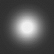\
**Рисунок 1.1**. Пример функции рассеяния точки

На практике глобальная фильтрация применяется редко. Чаще используют локальную фильтрацию, когда интегрирование и усреднение проводится не по всей области определения $x$ и $y$, а по сравнительно небольшой окрестности каждой точки изображения. Функция рассеяния точки при этом имеет ограниченные размеры. Достоинством такого подхода является хорошее быстродействие. Линейное преобразование принимает вид:

$$g_{ij}=\sum_{D} a_{kI}f1 +kj +1 \quad (2)$$

При обработке растровых изображений, которые состоят из отдельных пикселов, интегрирование заменено суммированием. Проще всего реализовать ФРТ конечных размеров в виде прямоугольной матрицы форматом $N ´N$. $N$ может быть равным 3, 5, 7 и т.д. Например, при $N = 3$

$$H=1K\begin{vmatrix}
a_{11} & a_{12} & a_1 \\
a_{21} & a_{22} & a_2 \\
a_{31} & a_{32} & a_3
\end{vmatrix} $$

Суммирование ведется по окрестности $D$ точки $(i, j)$; $a_{kl}$ $-$ значения ФРТ в этой окрестности. Яркости пикселов $f$  в этой точке и в её окрестности умножаются на коэффициенты $a_{kl}$, преобразованная яркость $(i,j)$  -го пиксела есть сумма этих произведений. Элементы матрицы удовлетворяют условию пространственной инвариантности, поэтому $a11= a13 =a_{31}= a_{33}, a_{12} = a_{21}= a_{23} = a_{32}$. Только три элемента матрицы размером $3х3$ независимы, в этом случае матрица инвариантна относительно поворотов, кратных $90˚$. Опыт обработки изображений показывает, что отсутствие более строгой осевой симметрии ФРТ слабо сказывается на результатах. Иногда используют 8 -угольные матрицы, инвариантные относительно поворотов на $45˚$.

Фильтрация согласно $(2)$ осуществляется перемещением слева направо (или сверху вниз) маски на один пиксел. При каждом положении апертуры производятся упомянутые выше операции, а именно перемножение весовых множителей $a_{kl}$ с соответствующими значениями яркостей исходного изображения и суммированием произведений. Полученное значение присваивается центральному $(i,j)$  -му пикселу. Обычно это значение делится на заранее заданное число K (нормирующий множитель). Маска содержит нечетное число строк и столбцов $N$, чтобы центральный элемент определялся однозначно.

Рассмотрим некоторые фильтры, сглаживающие шум. Пусть маска размером $3х3$ имеет вид:

$$H_1=1/1\begin{vmatrix}
1 & 1 & 1 \\
1 & 2 & 1 \\
1 & 1 & 1
\end{vmatrix} $$

Тогда яркость  $(i,j)$ -го пиксела после фильтрации определится как

$$g_{ij}=1/10(f_{(i-1),(j-1)}+ f_{(i-1),j}+f_{i,{(j-1)}} + f_{i,{(j-1)}} + 2f_{ij} + f_{ij+1} + f_{i+1, (j-1)} +  f_{i+1,j} + f_{i+1,j+1})$$

Хотя коэффициенты  $a_{kl}$  можно выбрать из среднеквадратического или иного условия близости не искаженного шумом  $s_{i,j}$ и преобразованного $g_{i,j}$  изображений, обычно их задают эвристически. Приведем еще некоторые матрицы шумоподавляющих фильтров:

$$H_2=1/2\begin{vmatrix}
1 & 1 & 1 \\
1 & 1 & 1 \\
1 & 1 & 1
\end{vmatrix}, H_3=1/16\begin{vmatrix}
1 & 2 & 1 \\
2 & 4 & 2 \\
1 & 2 & 1
\end{vmatrix}, H_4=1/14\begin{vmatrix}
2 & 1 & 2 \\
1 & 2 & 1 \\
2 & 1 & 2
\end{vmatrix} $$

У фильтров $H_1 - H_4$  нормирующие множители K подобраны таким образом, чтобы не происходило изменения средней яркости обработанного изображения. Наряду с масками $3х3$ используются маски большей размерности, например, $5х5$, $7х7$ и т.п. В отличие от фильтра $H_2$, у фильтров $H_1, H_3, H_4$  весовые коэффициенты на пересечении главных диагоналей матрицы больше, чем коэффициенты, стоящие на периферии. Фильтры $H_1, H_3, H_4$ дают более плавное изменение яркости по изображению, чем $H_2$.

Пусть отсчеты полезного изображения $f_{k,m}$ мало меняются в пределах маски. На изображение накладывается аддитивный шум: $f_{k,m} + n_{k,m}$, отсчеты шума $n_k,m$ случайны и независимы (или слабо зависимы) со статистической точки зрения. В этом случае механизм подавления шума с использованием приведенных фильтров состоит в том, при суммировании шумы компенсируют друг друга. Эта компенсация будет происходить тем успешнее, чем большее число членов в сумме, т.е. чем больше размер (апертура) маски. Пусть, например, используется маска $N ´N$, в пределах её полезное изображение имеет постоянную яркость f, шум с независимыми значениями отсчетов nk,m, средним значением $μ = 0$ и дисперсией $\sigma^2$  в пределах маски (такой шум называют белым). Отношение квадрата яркости $(i,j)$-го пиксела к дисперсии шума, т.е. отношение сигнал/шум, равно $f^2/\sigma^2$.

Рассмотрим, например, маску типа $H_2$:

$$g_{ij}= 1/N^2\sum_{k=i}^{N}\sum_{m=1}^{N}(f+n_{k,m})=f + 1/N^2\sum_{k=1}^{N}\sum_{m=1}^{N} n_{k,m}$$

Средний квадрат яркости равен $f^2$, средний квадрат интенсивности шума

$$\langle n^2 _{i,j}\rangle = 1/N^4\sum_{k=1}^{N} \sum_{m=1}^{N} \langle n^2_{k,m}\rangle = f + 1/N^4 \sum_{k=1}^{N} \sum_{m=1}^{N} \sum_{k=1}^{N} \sum_{p=1}^{N} \langle n_{k,m }n_{q,p} \rangle$$

Двойная сумма отвечает $k= p, m = q$, эта сумма равна  $\sigma^2/N^2$.Четы­рехкратная сумма равна нулю, так как отсчеты шума при $k \neq p, m \neq q$ независимы: $<n k,mn p,q> = 0$. В результате фильтрации отношение сигнал/шум становится равным $N^2f^2/\sigma^2$, т.е. возрастает пропорционально площади маски. Отношение яркости $(i,j)$-го пиксела полезного изображения к среднеквадратическому отклонению шума возрастает пропорционально $N$. Применение маски $3х3$, в среднем, повышает отношение сигнала к шуму в 9 раз.

При импульсной помехе механизм подавления состоит в том, что импульс "расплывается" и становится мало заметным на общем фоне.

Однако часто в пределах апертуры значения полезного изображения все же изменяются заметным образом. Это бывает, в частности, когда в пределы маски попадают контуры. С физической точки зрения, все $H_1  - H_4$  являются фильтрами нижних частот (усред­няющими фильтрами), подавляющими высокочастотные гармоники и шума, и полезного изображения. Это приводит не только к ослаблению шума, но и к размыванию контуров на изображении. На рис. 6а показано исходное зашумленное изображение, результат применения фильтра типа $Н_2$ приведен на рис. 6б (маска $5х5$).

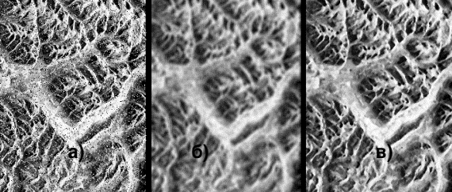
**Рисунок 1.1.2**. Линейная и нелинейная фильтрация.

Рассмотренная выше фильтрация характеризовалась тем, что выходные значения фильтра $g$ определялись только через входные значения фильтра $f$. Такие фильтры называются не рекурсивными. Фильтры, в которых выходные значения g  определяются не только через входные значения $f$, но и через соответствующие выходные значения, называются *рекурсивными*.

При рекурсивной фильтрации можно сохранять те же значения весовых множителей, что и приведенные выше, существуют рекурсивные фильтры со специально подобранными множителями. Элементы входного изображения  в пределах окна изменятся и примут вид:

$$XY=1\begin{vmatrix}
g_{(i-1),(j-1)} & g_{(i-1),j} & g_{(i-1),j+1} \\
g_{i,(j-1),(j-1)} & f_{i,j} & g_{i,j+1} \\
g_{i+1,(j-1)} & g_{i+1,j} & g_{i+1,j+1}
\end{vmatrix} $$

Весовые и нормирующий множители рекурсивного фильтра зависят от местоположения маски; рекурсивный локальный фильтр позволяет учитывать все входные значения фильтруемого изображения, т.е. приближается по своему действию к глобальному фильтру.

Для устранения эффекта размывания контуров при подавлении шума следует переходить к нелинейной обработке. Примером нелинейного фильтра для подавления шума служит медианный фильтр. При медианной фильтрации $(i,j)$-му пикселу присваивается медианное значение яркости, т.е. такое значение, частота которого равна $0,5$. Пусть, например, используется маска $3 ´3$, в пределы которой наряду с более или менее равномерным фоном попал шумовой выброс, этот выброс пришелся на центральный элемент маски:

$$H_1=1/1\begin{vmatrix}
68 & 79 & 74 \\
63 & 212 & 83 \\
66 & 71 & 89
\end{vmatrix} $$

Строится вариационный ряд. Вариационным рядом $V_1,..., V_n$ выборки $f_1,..., f_n$ называют упорядоченную по не убыванию последовательность элементов выборки, т.е. $V1 = min(f1,..., fn), V_n= max (f_1,..., f_n)$ и т.д. В нашем случае вариационный ряд имеет вид: $63, 66, 68, 71, 74, 79, 83, 89, 212$. Здесь медианное значение - пятое по счету (подчеркнуто), так как всего чисел в ряду $9$. При медианной фильтрации значение $212$, искаженное шумовым выбросом, заменяется на $74$, выброс на изображении полностью подавлен. Результат применения медианного фильтра показан на рис. 2в.

Функция рассеяния точки для медианного фильтра есть нуль. При размерах окна $(2k+1)\cdot(2k+1)$ происходит полное подавление помех, состоящих не более, чем из $2(k^2 + k)$ пикселов, а также тех, которые пересекаются не более, с $k$ строками или k столбцами, При этом не изменяется яркость в точках фона. Разумеется, при медианной фильтрации может происходить искажение объекта на изображении, но только на границе или вблизи нее, если размеры объекта больше размеров маски. Фильтр обладает высокой эффективностью при подавлении импульсных помех, однако это качество достигается подбором размеров маски, когда известны минимальные размеры объектов и максимальные размеры искаженных помехой локальных областей.

#### 1.2 Улучшение контраста

Слабый контраст $-$ наиболее распространенный дефект фотографических, сканерных и телевизионных изображений, обусловленный ограниченностью диапазона воспроизводимых яркостей. Под контрастом обычно понимают раз­ность максимального и минимального значений яркости. Путем цифровой обработки контраст можно повысить, изменяя яркость каждого элемента изображения и увеличивая диапазон яркостей. Для этого разработано несколько методов.

Пусть, например, уровни некоторого черно-белого изображения занимают интервал от $6$ до $158$ со средним значением яркости $67$ при возможном наибольшем интервале значений от $0$ до $255$. На рисунке 3а приведена гистограмма яркостей исходного изображения, показывающая, сколько пикселов $N$ с близким значением яркости $f$ попадает в интервал от $f_i$  до $f +\Delta f_i$. Это изображение является малоконтрастным, превалирует темный оттенок. Возможным методом улучшения контраста может стать так называемая линейная растяжка гистограммы (stretch), когда уровням исходного изображения, лежащим в интервале $[f_{мин}, f_{макс}]$, присваиваются новые значения с тем, чтобы охватить весь возможный интервал изменения яркости, в данном случае $[0, 255]$. При этом контраст существенно увеличивается (рис. 3б). Преобразование  уровней яркости осуществляется по формуле:

$$g_i=a+ bf_i \quad (3)$$

где $f_i$ старое значение яркости $i$-го пиксела, $g_i$ - новое значение, $a, b$ $-$ коэффициенты. Для рис. 4а $f_{мин} = 6$, $f_{макс} = 158$. Выберем $a$ и $b$ таким образом, чтобы $g_{мин} = 0$, $g_{макс} = 255$. Из (3) получаем: $a = - 10,01; b = 1,67$.

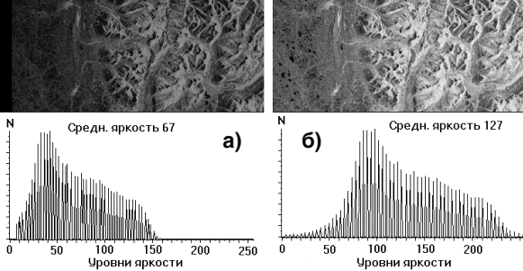

**Рисунок 1.2.1**. Исходное изображение (а) и изображение после линейной растяжки истограммы (б).

Еще более можно улучшить контраст, используя нормализацию гистограммы. При этом на весь максимальный интервал уровней  яркости $[0, 255]$ растягивается не вся гистограмма, лежащая в пределах от $f_{мин}$ до $f_{макс}$, а её наиболее интенсивный участок $(f_{мин'}, f_{макс'})$, из рассмотрения исключаются малоинформативные "хвосты". На рис. 4б исключено $5%$ пикселов.

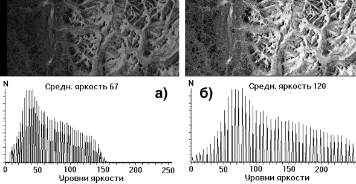
**Рисунок 1.2.2**. Нормализация гистограммы.

Целью выравнивания гистограммы (эту процедуру называют также *линеаризацией и эквализацией* $-$ equalization) является такое преобразование, чтобы, в идеале, все уровни яркости  приобрели бы одинаковую частоту, а гистограмма яркостей отвечала бы равномерному закону распределения (рис. 5).

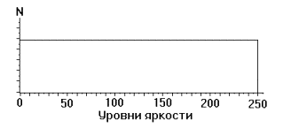\
**Рисунок 1.2.3**. Гистограмма отвечает равномерному закону распределения.

Пусть изображение имеет формат: $N$ пикселов по горизонтали и $M$ по вертикали, число уровней квантования яркости равно $J$. Общее число пикселов равно $N \cdot M$, на один уровень яркости попадает, в среднем, $n_o = N \cdot M/J$ пикселов. Например, $N = M = 512, J = 256$. В этом случае $n_o = 1024$. Расстояние $\Delta f$ между дискретными уровнями яркости от $f_i$ до $f_i+1_в$ гистограмме исходного изображения одинаковое, но на каждый уровень выпадает различное число пикселов. При эквализации гистограммы расстояние $\Delta g_i$ между уровнями $g_i$ и $g_i+1$ различно, но число пикселов на каждом уровне, в среднем, одинаковое и равно $n_o$. Алгоритм эквализации несложен. Пусть уровнями с малой яркостью обладает небольшое количество пикселов, как на рис. 5а. Например, уровень яркости 0 на исходном изображении имеют $188$ пикселов, уровень $1 - 347$

 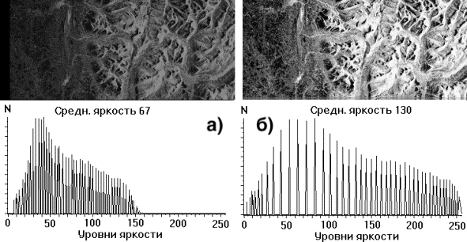\
**Рисунок 1.2.4**. Эквализация гистограммы.

пикселов, уровень  $2 - 544$ пиксела. В сумме это $1079$ пикселов, т.е. приблизительно no. Присвоим всем этим пикселам уровень $0$. Пусть на исходном изображении число пикселов с уровнями яркости $3$ и $4$ в сумме приблизительно также равно $n_o$. Этим пикселам присваивается уровень 1. С другой стороны, пусть число пикселов с уровнем $45$ на исходном изображении составляет $3012$, т.е. приблизительно $3n_o$. Всем этим пикселам присваивается некоторый одинаковый уровень $g_i$, не обязательно равный $45$, а соседние два уровня остаются незаполненными. Рассмотренные процедуры выполняются для всех уровней яркости. Результат эквализации можно видеть на рис. 5б. В каждом конкретном случае выбирают ту процедуру преобразования гистограмм, которая приводит к наилучшему, с точки зрения пользователя, результату.

### 2. Подавление шумов, пример порогового фильтра

Изображение может повреждаться шумами и помехами различного происхождения, например шумом видеодатчика, шумом зернистости фотоматериалов и ошибками в канале передачи. Их влияние можно минимизировать, пользуясь классическими методами статистической фильтрации. Другой возможный подход основан на использовании эвристических методов пространственной обработки.

Шумы видеодатчиков или ошибки в канале передачи обычно проявляются на изображении как разрозненные изменения изолированных элементов, не обладающие пространственной корреляцией. Искаженные элементы часто весьма заметно отличаются от соседних элементов. Это наблюдение послужило основой для многих алгоритмов, обеспечивающих подавление шума. Рис.1 поясняет простой пороговый метод подавления шума, при использовании которого последовательно измеряют яркость всех элементов изображения. Если яркость данного элемента превышает среднюю яркость группы ближайших элементов на некоторую пороговую величину, яркость элемента заменяется на среднюю яркость. Рис. 2.1 иллюстрирует эффективность этого алгоритма применительно к изображениям, переданным посредством ИКМ по двоичному симметричному каналу с вероятностью ошибок 10-2.

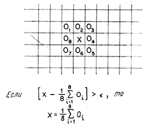\
**Рисунок 2.1**.

Поскольку шум пространственно декоррелирован, в его спектре, как правило, содержатся более высокие пространственные частоты, чем в спектре обычного изображения. Следовательно, простая низкочастотная пространственная фильтрация может служить эффективным средством сглаживания шумов. В соответствии с методами, рассмотренными в части 3, массив $Q$ размера $М\timesМ$ выходного изображения формируется путем дискретной свертки массива $F$ размера $N\times N$ исходного изображения со сглаживающим массивом $H$ размера $L\times L$ согласно формуле

$$Q(m_1,m_2)=\sum_{n_1}\sum_{n_2} F(n_1,n_2)H(m_1 - n_1 + 1, m_2- n_2 +1)$$

Сглаживание шума обеспечивается низкочастотной фильтрацией с помощью массива H с положительными элементами. Ниже приведены сглаживающие массивы трех разновидностей, часто называемые шумоподавляющими масками:

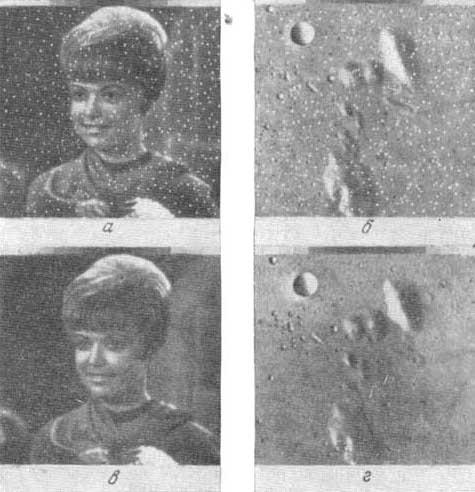\
**Рисунок 2.2**. Образцы изображений, обработанных методом порогового подавления шума при $\epsilon=49$.\
*а $-$  зашумленное изображение "Портрет"; б $-$ зашумленное изображение лунной поверхности, в $-$ обработанное изображение а; г $-$ обработанное изображение б.*

Маска 1

$$H=\frac{1}{9} \begin{vmatrix}
1 & 1 & 1 \\
1 & 1 & 1 \\
1 & 1 & 1
\end{vmatrix},$$

маска 2

$$H=\frac{1}{10} \begin{vmatrix}
1 & 1 & 1 \\
1 & 2 & 1 \\
1 & 1 & 1
\end{vmatrix},$$

маска 3

$$H=\frac{1}{16} \begin{vmatrix}
1 & 2 & 1 \\
2 & 4 & 2 \\
1 & 2 & 1
\end{vmatrix}.$$

Эти массивы нормированы для получения единичного коэффициента передачи, чтобы процедура подавления шума не вызывала смещения средней яркости обработанного изображения. Эффективность приведенных масок иллюстрирует рис 2.3.

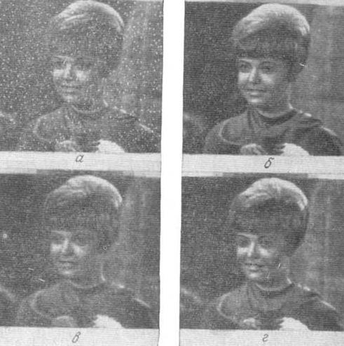\
**Рисунок 2.3**. Образцы изображений подвергнутыхнизкочастотоной фильтрации.\
*а $-$ зашумленное исходное изображение; б $-$ действие маски 1;  в $-$ действие маски 2; г $-$ действие маски 3.*

Если требуемое подавление шума сопряжено с использованием массивов большого размера, целесообразно выполнять свертку косвенным образом, применяя преобразование Фурье, так как обычно это дает выигрыш в объеме вычислении.

### 3. Медианная фильтрация

Медианная фильтрация $-$ метод нелинейной обработки сигналов, разработанный Тьюки. Этот метод оказывается полезным при подавлении шума на изображении.

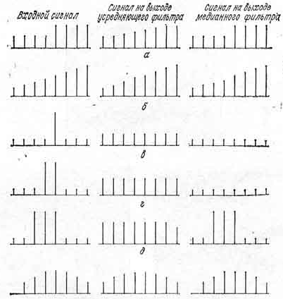\
**Рисунок 3.1**. Примеры медианной фильтрации простейших дискретных сигналов,  $L=5$.\
*а $-$ ступенчатый переход; б $-$ пилообразный переход; в $-$ одиночный импульс; г $-$ сдвоенный импульс; д $-$ строенный импульс; е $-$ треугольный сигнал.*

Одномерный медианный фильтр представляет собой скользящее окно, охватывающее нечетное число элементов изображения. Центральный элемент заменяется медианой всех элементов изображения в окне.Медианой дискретноq последовательности $а_1 а_2, ..., а_N$ для нечетного N является тот ее элемент, для которого существуют $(N - 1)/2$ элементов, меньших или равных ему по величине, и $(N - 1)/2$ элементов, больших или равных ему по величине. Пусть в окно попали элементы изображения с уровнями $80, 90, 200, 110 и 120$; в этом случае центральный элемент следует заменить значением $110$, которое является медианой упорядоченной последовательности $80, 90, 110, 120, 200$.

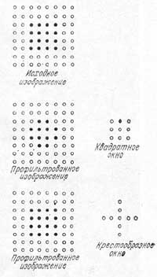\
**Рисунок 3.2**. Примеры двумерной медианной фильтрации.

Если в этом примере значение $200$ является шумовым выбросом в монотонно возрастающей последовательности, то медианная фильтрация обеспечит существенное улучшение. Напротив, если значение $200$ соответствует полезному импульсу сигнала (при использовании широкополосных датчиков), то обработка приведет к потере четкости воспроизводимого изображения. Таким образом, медианный фильтр в одних случаях обеспечивает подавление шума, в других $-$ вызывает нежелательное подавление сигнала.

На рис. 3.1 показано воздействие медианного и усредняющего (сглаживающего) фильтров с пятиэлементным окном на ступенчатый, пилообразный, импульсный и треугольный дискретные сигналы. Из этих диаграмм видно, что медианныи фильтр не влияет на ступенчатые или пилообразные функции, что обычно является желательным свойством. Однако этот фильтр подавляет импульсные сигналы, длительность которых составляет менее половины ширины окна. Фильтр также вызывает уплощение вершины треугольной функции.

Возможны различные стратегии применения медианного фильтра для подавления шумов. Одна из них рекомендует начинать с медианного фильтра, окно, которого охватывает три элемента изображения.

Если ослабление сигнала незначительно, окно фильтра расширяют до пяти элементов. Так поступают до тех пор, пока медианная фильтрация начинает приносить больше вреда, чем пользы. Другая возможность состоит в осуществлении каскадной медианной фильтрации сигнала с использованием фиксированной или изменяемой ширины окна. В общем случае те области, которые остаются без изменения после однократной обработки фильтром, не меняются и после повторной обработки. Области, в которых длительность импульсных сигналов составляет менее половины ширины окна, будут подвергаться изменениям после каждого цикла обработки.

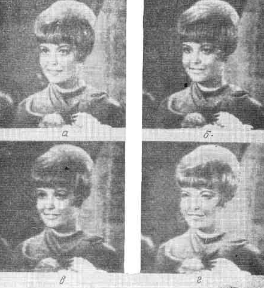\
**Рисунок 3.3**. Образцы изображений, обработанных одномерным медианным фильтром с целью подавления импульсных помех.\
*а $-$ исходное изображение с импульсными помехами (15 искаженных элементов в каждой строке); б $-$ результат медианной фильтрации при $L=3$;  в $-$ результат медианной фильтрации при $L=5$; г $-$ результат медианной фильтрации при $L=7$.*

Концепцию медианного фильтра легко обобщить на два измерения, применяя двумерное окно желаемой формы, например прямоугольное или близкое к круговому. Очевидно, что двумерный медианный фильтр с окном размера $L \times L$ обеспечивает более эффективное подавление шума, чем последовательно примененные горизонтальный и вертикальный одномерные медианные фильтры с окном размера $L \times 1$; двумерная обработка, однако, приводит к более существенному ослаблению сигнала. На рис. 3.2 показано влияние двумерной медианной фильтрации на пространственный импульсный сигнал. Использовались фильтры с окнами двух типов; квадратным размера $3 \times 3$ и крестообразным размера $5 \times 5$. Как видно, медианный фильтр с квадратным окном разрушил углы изображенного квадрата, а фильтр с крестообразным окном оставил его без изменения.

\
**Рисунок 3.4**. Образцы изображений, обработанных одномерным медианным фильтром с целью подавления гауссова шума.\
*а $-$ исходное изображение с гауссовым шумом $\sigma_n=25$; б $-$ результат медианной фильтрации при $L=3$;  в $-$ результат медианной фильтрации при $L=5$; г $-$ результат медианной фильтрации при $L=7$.*

На рис. 3.3 и 3.4 представлены образцы изображении, подвергнутых медианной фильтрации с целью подавления шумов. Как видно, медианный фильтр более эффективно подавляет разрозненные импульсные помехи, чем гладкие шумы. Медианную фильтрацию изображении в целях подавления шумов следует считать эвристическим методом. Ее нельзя применять вслепую. Напротив, следует проверять получаемые результаты, чтобы убедиться в целесообразности медианной фильтрации.

### 4. Медианный фильтр

#### 4.1 Изучение алгоритма функционирования простого медианного фильтра

Алгоритм функционирования простого медианного фильтра основан на нахождении медианы цифрового окна и замены конкретной точки в окне на медиану окна. Под цифровым окном понимается выборка некоторого массива чисел из основного массива чисел, полученного с помощью преобразования исходного изображения в числовой массив по специальному алгоритму. Окно может быть выбрано также по специальному алгоритму. От выбора алгоритма зависит форма окна, а также непосредственно влияет на результат работы фильтра.
В данной работе применялся алгоритм фильтрации двумерного массива, по этому применялись алгоритмы получения окон прямоугольной и крестообразной форм.

Алгоритм получения прямоугольного окна можно разделить на такие шаги:
1. Задание двух размерностей окна - высоты и ширины, причем обе размерности должны быть нечетными целыми числами.
2. Непосредственный выбор элементов окна из исходного изображения, что проиллюстрировано на Рис 4.1.1.

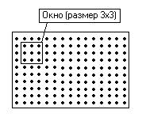\
**Рисунок 4.1.1**. Изображение с окном размером $3 \times3$.

Алгоритм получения крестообразного окна можно разделить на такие шаги:

1. Задание четырех размерностей окна $-$ это ширина, высота и координаты пересечения прямых креста, причем обе размерности должны быть нечетными целыми числами.

2. Непосредственный выбор элементов окна из исходного изображения, что проиллюстрировано на Рис 4.1.2.

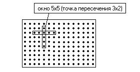\
**Рисунок 4.1.2**. Изображение с крестообразным окном размером $5 \times 5$ и точкой пересечения с координатами $3,2..$

Для получения медианы окна нужно массив, полученный выбором чисел из окна, преобразовать к массиву с одним измерением. Далее этот массив нужно отсортировать, и из отсортированного массива выбрать медиану. Для выбора медианы можно использовать формулу:

$$M=A[(N-1)/2+1], \quad (4.1)$$

где $М$ $-$ медиана;\
$A$ $-$ отсортированный массив;\
$N$ $-$ размер. Далее медианой заменяется одна из точек окна, которая из них $-$ зависит от формы окна. При использовании окна прямоугольной формы заменяемая точка находится в центре прямоугольника, а координаты ее положения в окне можно найти по формулам:

$$X=(N-1)/2+1, \quad (4.2)$$

где $N$ $-$ ширина окна.

$$Y=(M-1)/2+1, \quad (4.3)$$

где $M$ $-$ высота окна.
При использовании окна крестообразной формы координаты заменяемой точки равны координатам точки пересечения.Меняя точку пересечения, для крестообразного окна, и меняя координаты заменяемой точки, для окна прямоугольной формы можно добиться улучшения качества фильтрования.

#### 4.2 Изучение алгоритма функционирования взвешенного медианного фильтра.

Алгоритм функционирования взвешенного медианного фильтра сходен с алгоритмом для обычной медианной фильтрации, описанной в предыдущей главе. Единственное отличие состоит в выборе медианы.\
В результате выбора данных, из окна какой либо формы, получается массив с нечетным числом элементов. Для использования взвешенного медианного метода фильтрации, полученный массив следует преобразовать к определенному виду. Т.е. каждому элементу сопоставляется определенный вес. Этот вес является целым числом, определяющим число раз повторения этого элемента. Т.е. таким образом, усиливается значимость элементов расположенных в конкретных позициях в окне. При правильном подборе весов элементов существует возможность увеличения качества фильтрации.
