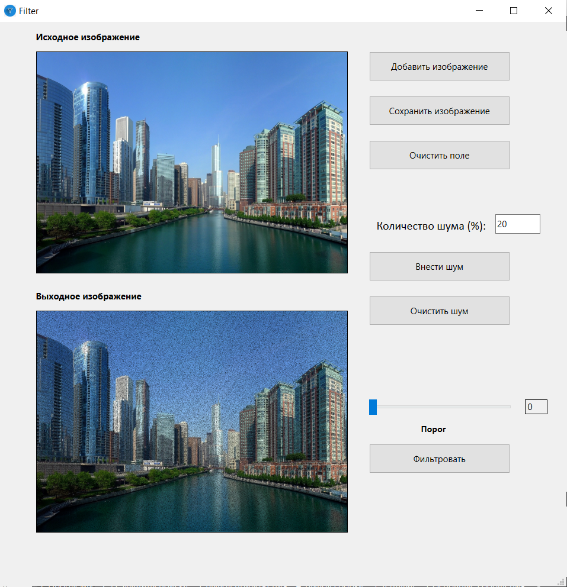

# Лабораторная работа №1

## Тема

Фильтрация изображения от импульсных помех.

## Цель работы

Фильтрация изображения от импульсных помех.

## Вариант 1

## Реализация/ход работы
Был реализован алгоритм порогового фильтра. Пример работы:

Исходное изображение:

Зашумленное изображение:

Отфильтрованное изображение:

Графический интерфейс приложения:

