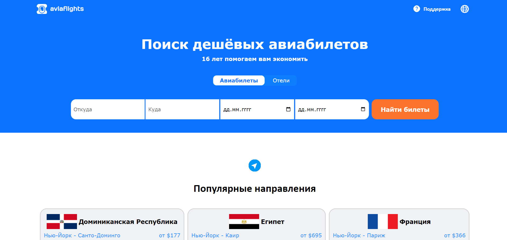
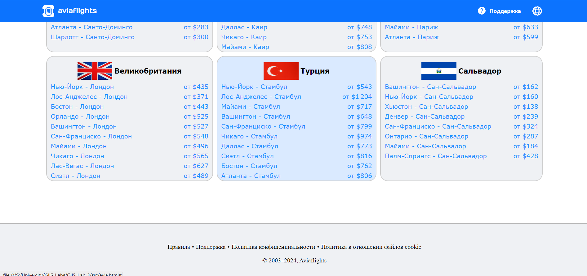
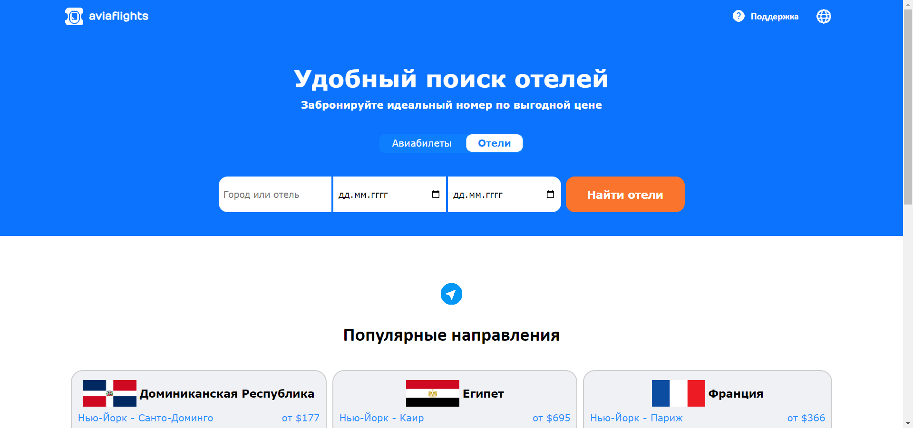
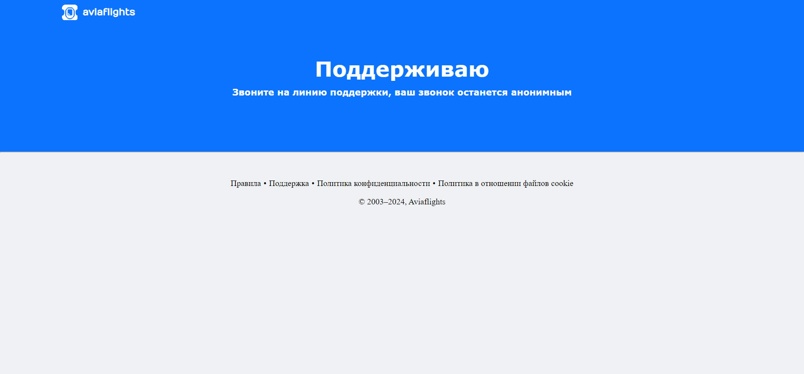
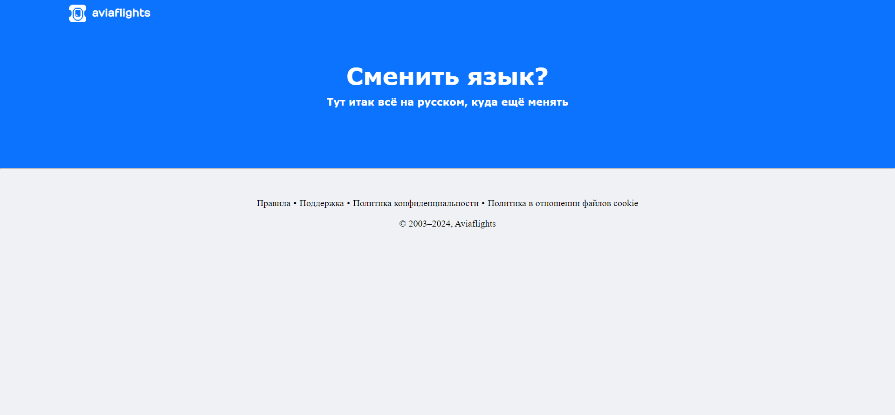

# Лабораторная работа №3

## Разработка веб-сайта

Создание веб-сайта

## Цель работы

Получить знания по созданию веб-сайта.

## Реализация/ход работы
В ходе работы над лабораторной работой был создан веб-сайт с помощью HTML и CSS.

## Результат работы

Основная страница:

Основная страница(продолжение):

Cтраница с отелями:

Cтраница поддержки:

Cтраница смены языка:

