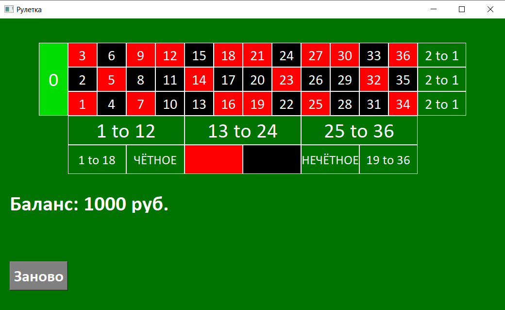
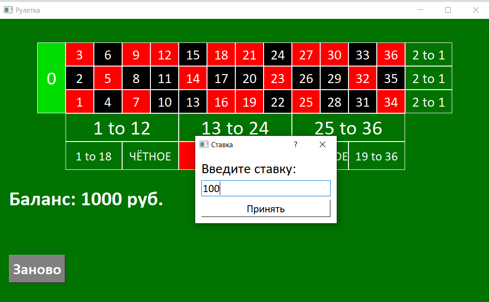
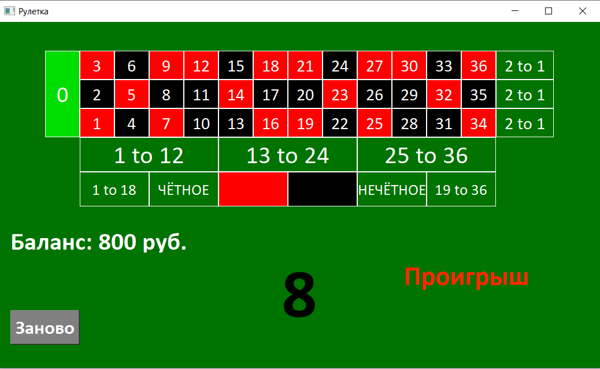
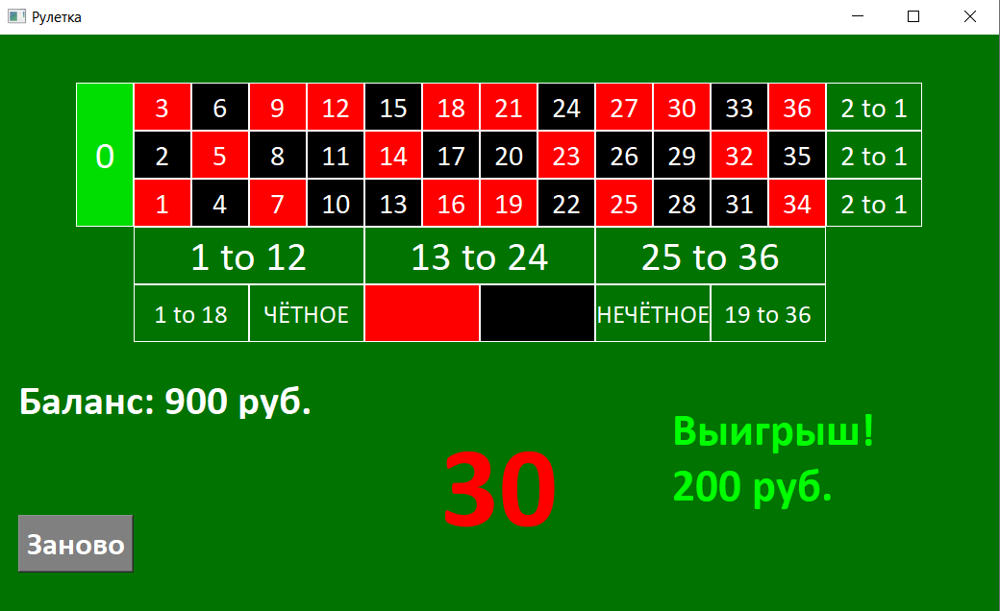

# Лабораторная работа №4-5

## Разработка игры

Создание адресной книги

## Цель работы

Получить знания по разработке игр.

## Реализация/ход работы
В ходе работы над лабораторной работой была реализована игра "Casino" на языке Python при помощи библиотеки PyQt5.

## Результат работы

Старт приложения:

Делаем ставку:

Проиграли:

Выиграли:

