# Лабораторная работа №1 #

МИНИСТЕРСТВО ОБРАЗОВАНИЯ РЕСПУБЛИКИ БЕЛАРУСЬ
 
УЧРЕЖДЕНИЕ ОБРАЗОВАНИЯ
 
“БРЕСТСКИЙ ГОСУДАРСТВЕННЫЙ ТЕХНИЧЕСКИЙ УНИВЕРСИТЕТ”
 
ИНТЕЛЕКТУАЛЬНЫЕ ИНФОРМАЦИОННЫЕ ТЕХНОЛОГИИ
 
ОТЧЁТ
 
По лабораторной работе № 1

Выполнил:
 
Cтудент группы ИИ-22
 
Полиенко В. Э.
 
Проверила:
 
Ситковец Я.С

Брест – 2024

## Цель работы ##

Фильтрация изображения от импульсных помех.
## Вариант 2 ##

## Задание ##

Составить программу, выполняющую фильтрацию изображения от импульсных помех.
Необходимые характеристики:

<li>Изображение хранится во внешнем файле;</li>
<li>программно в изображение вносятся помехи;</li>
<li>программа должна выводить исходное и отфильтрованное изображения;</li>
<li>Должна присутствовать возможность выбора уровня зашумления.</li>
<li>Использовать медианный фильтр. Окно должно осуществлять проход изображения по строкам и столбцам.</li>

## Результат работы ##

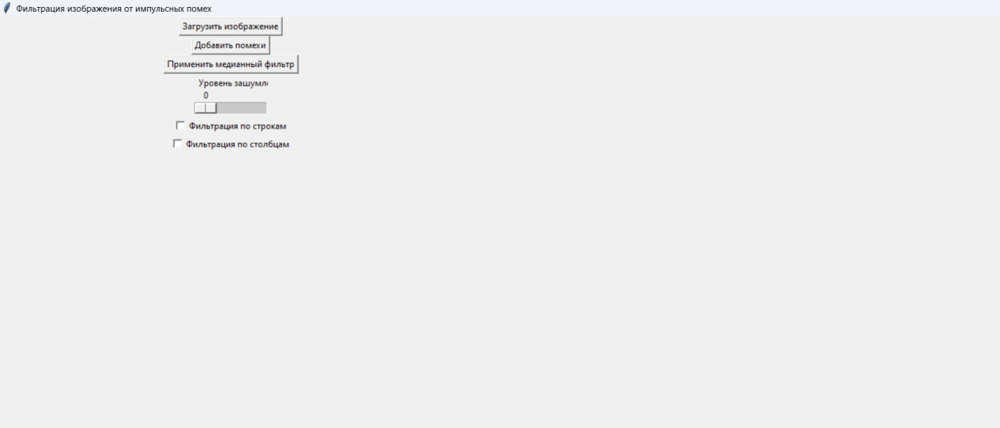
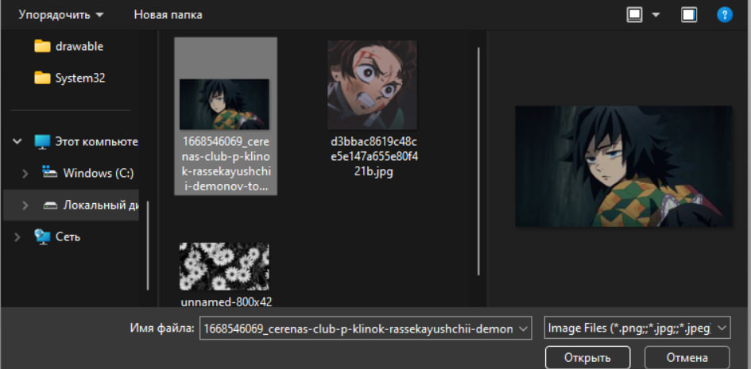
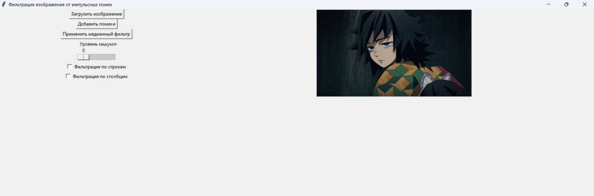
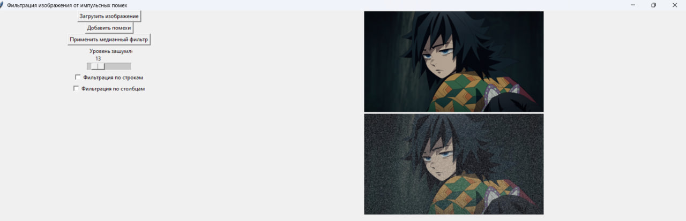
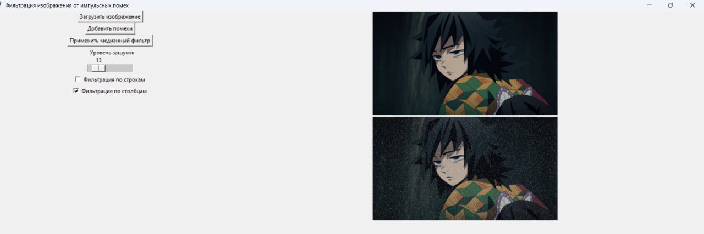
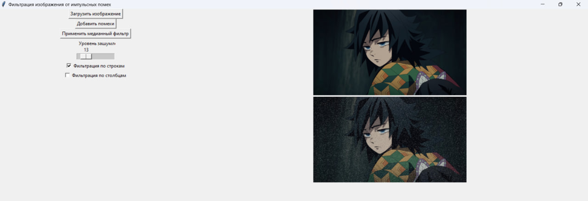
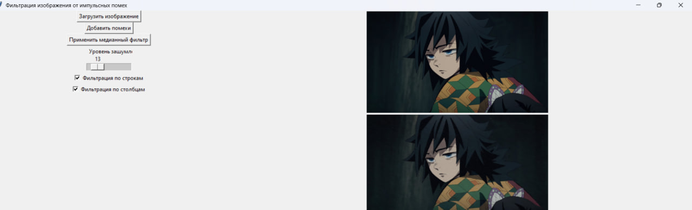
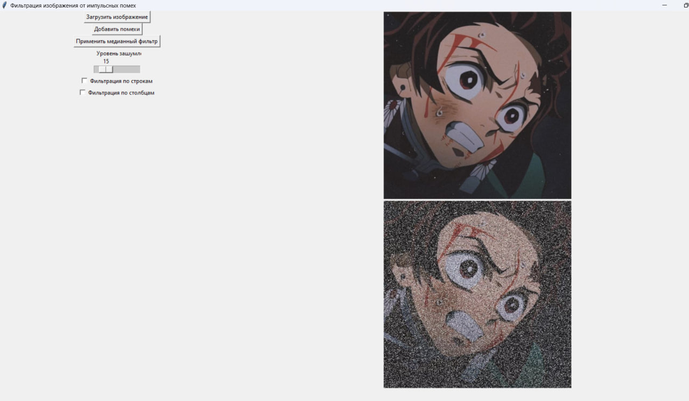
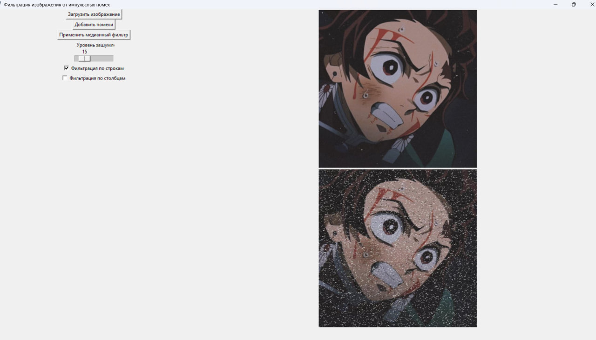
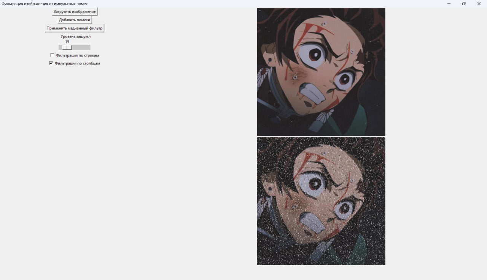
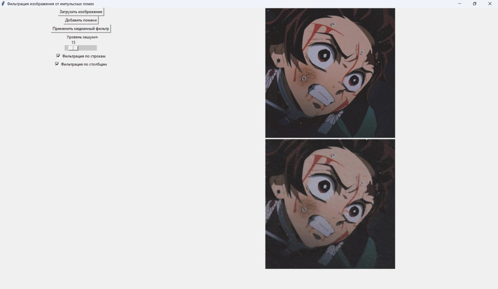