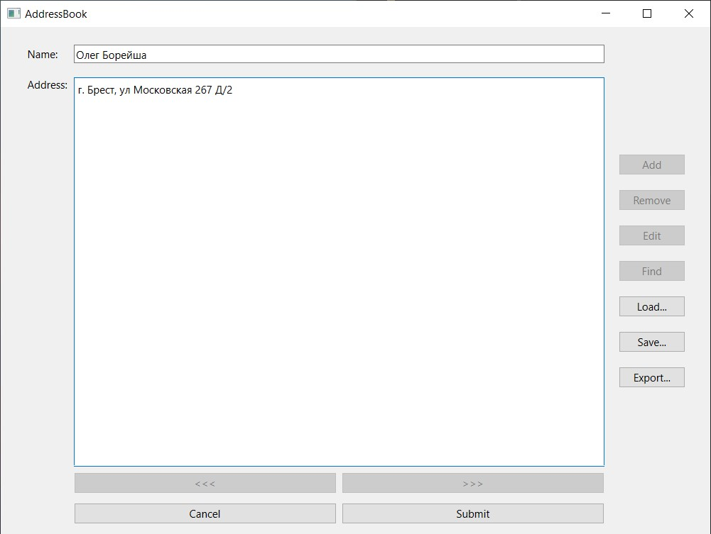
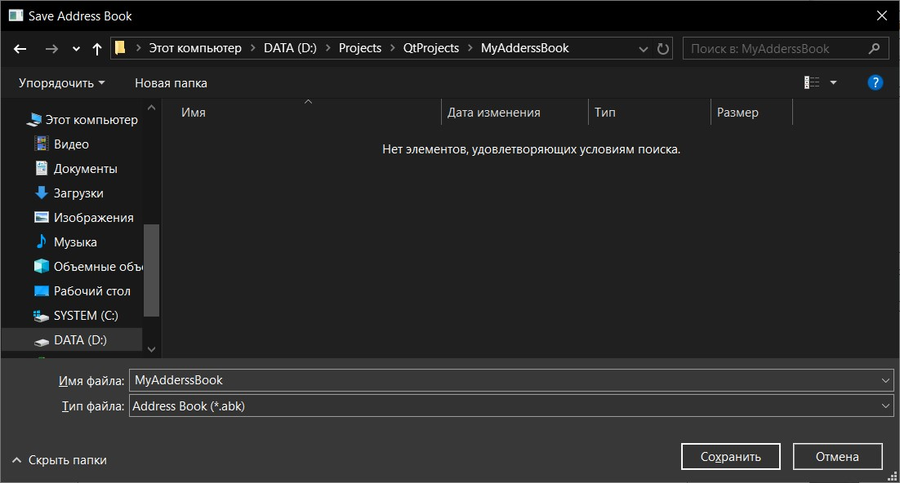

# Лабораторная работа № 2
## Разработка приложения "Адресная книга" средствами Qt

## Цель работы 
Изучить базовые компоненты средства разработки графического интерфейса среды Qt

## Ход работы
В ходе работы над лабораторной работой была реализована программа "Адресная Книга", которая позволяла при помощи графического интерфейса пользователя
добавлять записи, просматривать их, редактировать, сохранять/открывать файлы с записями, а так же экспортировать их в другой формат.

## Графический интерфейс пользователя и результат работы

