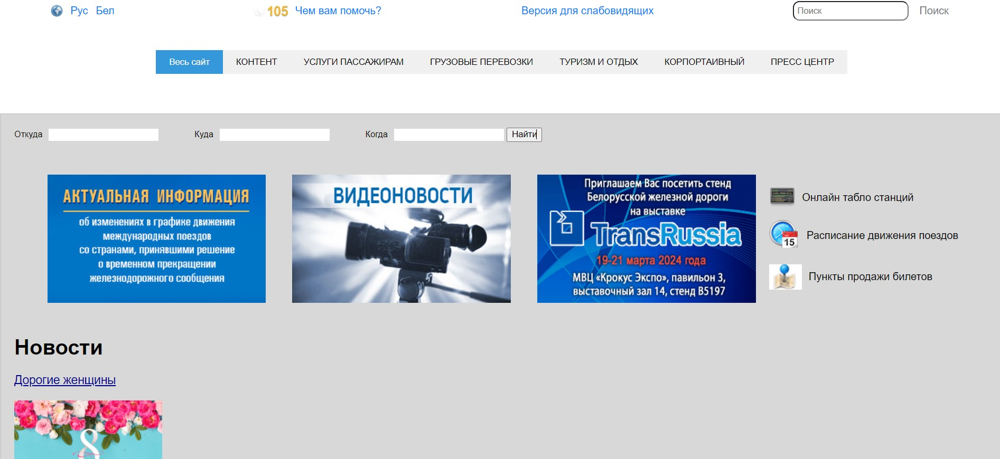
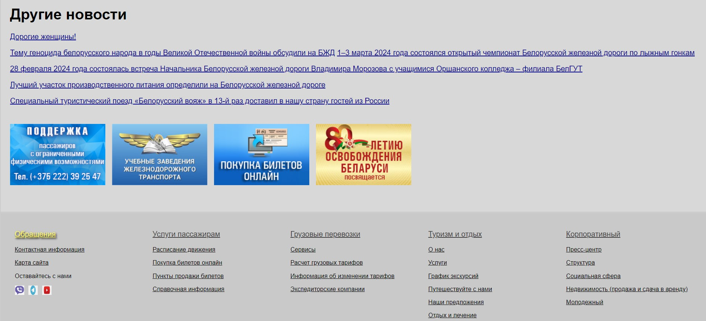
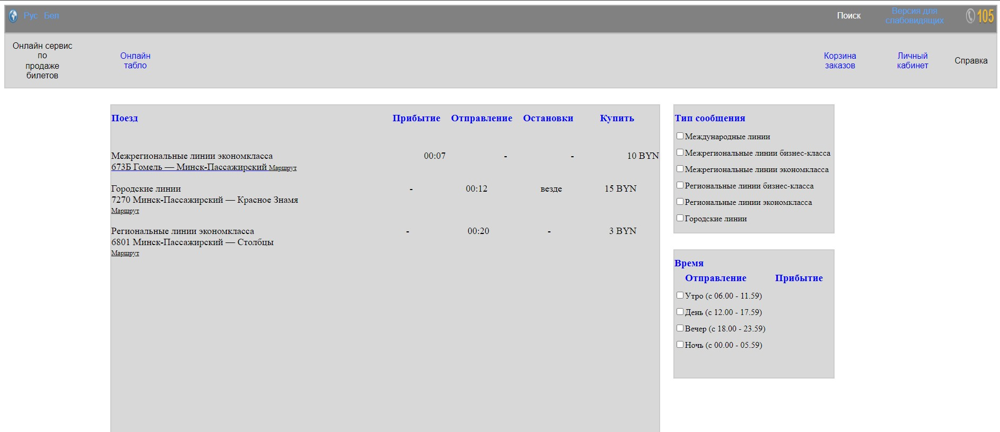
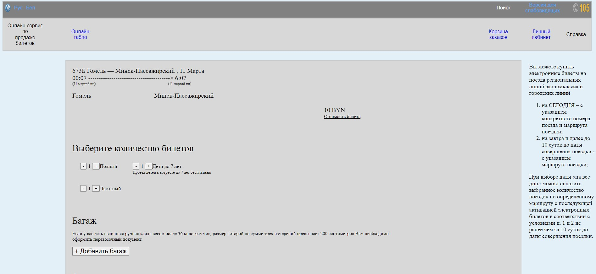

# Лабораторная работа № 3

## Разработка макета сайта без функциональной части

## Цель работы 
Разработатьь макет высокого уровня сайта

## Ход работы
В ходе работы был разработан сайт покупки ЖД билетов без функциональной части с помощью языка разметки HTML и стилей CSS

## Результат работы

