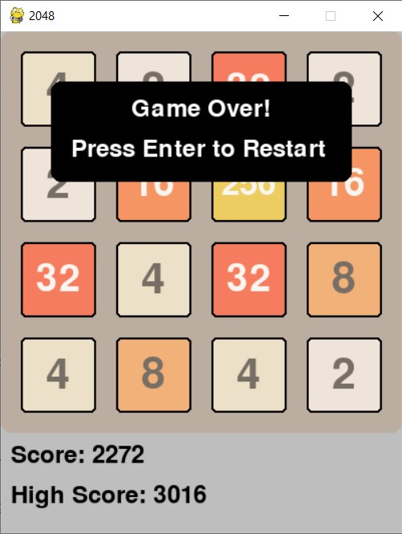

# Лабораторная работа № 4-5

## Разработка игры

## Цель работы 
Получить знания по разработке игр.

## Ход работы
В ходе работы над лабораторной работой была реализована игра "2048" на языке Python при помощи библиотеки pygame.

## Результат работы

