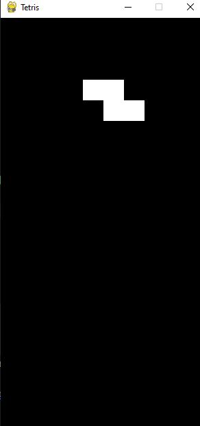
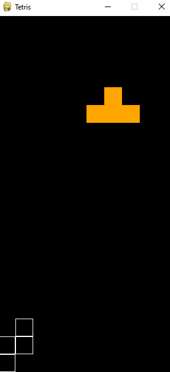

# Лабораторная работа № 4-5

## Разработка игры

## Цель работы 
Изучить разработку игры.

## Ход работы
В ходе работы над лабораторной работой была реализована игра "Tetris" на языке Python при помощи библиотеки pygame.

## Код программы
import pygame
import random
import time

# Определение цветов
BLACK = (0, 0, 0)
WHITE = (255, 255, 255)
GRAY = (128, 128, 128)
CYAN = (0, 255, 255)
YELLOW = (255, 255, 0)
MAGENTA = (255, 0, 255)
ORANGE = (255, 165, 0)
GREEN = (0, 255, 0)
BLUE = (0, 0, 255)

# Определение размеров поля и ячейки
CELL_SIZE = 30
BOARD_WIDTH = 10
BOARD_HEIGHT = 20
WINDOW_WIDTH = CELL_SIZE * BOARD_WIDTH
WINDOW_HEIGHT = CELL_SIZE * BOARD_HEIGHT

# Фигуры тетриса
SHAPES = [
    [[1, 1, 1],
     [0, 1, 0]],

    [[0, 2, 2],
     [2, 2, 0]],

    [[3, 3],
     [3, 3]],

    [[0, 4, 0],
     [4, 4, 4]],

    [[5, 0],
     [5, 0],
     [5, 5]],

    [[0, 6],
     [0, 6],
     [6, 6]],

    [[7, 7, 0],
     [0, 7, 7]]
]

class Tetris:
    def __init__(self):
        self.board = [[0] * BOARD_WIDTH for _ in range(BOARD_HEIGHT)]
        self.current_piece = self.new_piece()
        self.score = 0
        self.game_over = False
        self.last_drop_time = time.time()
        self.drop_interval = 1.0  # 1 second drop interval
        self.drop_acceleration = 0.05  # Speed increase per tick when down arrow is held

    def new_piece(self):
        shape = random.choice(SHAPES)
        piece = {'shape': shape,
                 'x': BOARD_WIDTH // 2 - len(shape[0]) // 2,
                 'y': 0}
        return piece

    def draw_piece(self, surface):
        shape = self.current_piece['shape']
        x, y = self.current_piece['x'], self.current_piece['y']
        for i in range(len(shape)):
            for j in range(len(shape[i])):
                if shape[i][j]:
                    pygame.draw.rect(surface, self.piece_color(shape[i][j]), pygame.Rect((x + j) * CELL_SIZE, (y + i) * CELL_SIZE, CELL_SIZE, CELL_SIZE))

    def draw_board(self, surface):
        for i in range(BOARD_HEIGHT):
            for j in range(BOARD_WIDTH):
                pygame.draw.rect(surface, self.piece_color(self.board[i][j]), pygame.Rect(j * CELL_SIZE, i * CELL_SIZE, CELL_SIZE, CELL_SIZE), 1)

    def piece_color(self, num):
        colors = [BLACK, CYAN, YELLOW, MAGENTA, ORANGE, GREEN, BLUE, WHITE, GRAY]
        return colors[num]

    def valid_position(self, shape, x, y):
        for i in range(len(shape)):
            for j in range(len(shape[i])):
                if shape[i][j]:
                    if not (0 <= x + j < BOARD_WIDTH and 0 <= y + i < BOARD_HEIGHT) or self.board[y + i][x + j]:
                        return False
        return True

    def rotate(self):
        shape = self.current_piece['shape']
        rotated_shape = [[shape[j][i] for j in range(len(shape))] for i in range(len(shape[0]) - 1, -1, -1)]
        if self.valid_position(rotated_shape, self.current_piece['x'], self.current_piece['y']):
            self.current_piece['shape'] = rotated_shape

    def move(self, dx):
        if self.valid_position(self.current_piece['shape'], self.current_piece['x'] + dx, self.current_piece['y']):
            self.current_piece['x'] += dx

    def drop(self):
        if time.time() - self.last_drop_time > self.drop_interval:
            self.last_drop_time = time.time()
            if self.valid_position(self.current_piece['shape'], self.current_piece['x'], self.current_piece['y'] + 1):
                self.current_piece['y'] += 1
            else:
                self.lock_piece()

    def lock_piece(self):
        shape = self.current_piece['shape']
        x, y = self.current_piece['x'], self.current_piece['y']
        for i in range(len(shape)):
            for j in range(len(shape[i])):
                if shape[i][j]:
                    self.board[y + i][x + j] = shape[i][j]
        self.clear_lines()
        self.current_piece = self.new_piece()
        if not self.valid_position(self.current_piece['shape'], self.current_piece['x'], self.current_piece['y']):
            self.game_over = True

    def clear_lines(self):
        lines_to_clear = [i for i, row in enumerate(self.board) if all(row)]
        for row in reversed(lines_to_clear):
            del self.board[row]
            self.board.insert(0, [0] * BOARD_WIDTH)
        self.score += len(lines_to_clear)

    def draw(self, surface):
        surface.fill(BLACK)
        self.draw_board(surface)
        self.draw_piece(surface)
        pygame.display.update()

def main():
    pygame.init()
    screen = pygame.display.set_mode((WINDOW_WIDTH, WINDOW_HEIGHT))
    pygame.display.set_caption('Tetris')

    clock = pygame.time.Clock()
    tetris = Tetris()

    while not tetris.game_over:
        for event in pygame.event.get():
            if event.type == pygame.QUIT:
                tetris.game_over = True
            elif event.type == pygame.KEYDOWN:
                if event.key == pygame.K_LEFT:
                    tetris.move(-1)
                elif event.key == pygame.K_RIGHT:
                    tetris.move(1)
                elif event.key == pygame.K_DOWN:
                    tetris.drop()
                elif event.key == pygame.K_UP:
                    tetris.rotate()

        keys = pygame.key.get_pressed()
        if keys[pygame.K_DOWN]:  # If the down arrow key is held
            tetris.drop_interval = max(0.1, tetris.drop_interval - tetris.drop_acceleration)
        else:
            tetris.drop_interval = 1.0

        tetris.drop()
        tetris.draw(screen)
        clock.tick(5)

    pygame.quit()

if __name__ == '__main__':
    main()

## Результаты работы

