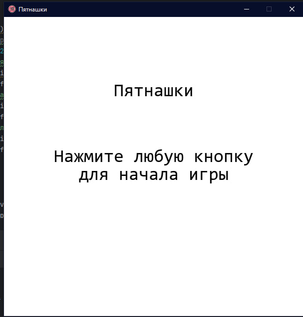
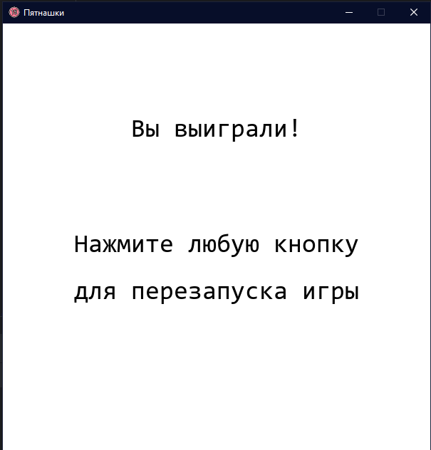

# Лабораторная работа № 4-5

## Разработка игры

## Цель работы 
Изучить разработку игры.

## Ход работы
В ходе работы над лабораторной работой была реализована игра "Пятнашки" на языке Python при помощи библиотеки pygame.

## Код программы
main.py (отвечает за запуск приложения приложения)
```python
import sys
import copy
import pygame
import random


def init():
    # Инициализация Pygame и модуля для работы со шрифтами.
    pygame.init()
    pygame.font.init()

    # Создание заголовка и иконки игры.
    pygame.display.set_caption("Пятнашки")
    icon = pygame.image.load("icon.png")
    pygame.display.set_icon(icon)

    # Создание окна и объекта шрифта.
    return pygame.display.set_mode((600, 600)), pygame.font.SysFont('Consolas', 36)

def start_screen(screen, font):
    # Отрисовка стартового экрана.
    screen.fill(pygame.Color(255, 255, 255))
    fontsurf = font.render("Пятнашки", True, pygame.Color(0, 0, 0))
    left, top = (screen.get_width() / 2 - fontsurf.get_width() / 2, screen.get_height() / 4 - fontsurf.get_height() / 2)
    screen.blit(fontsurf, (left, top))
    fontsurf = font.render("Нажмите любую кнопку", True, pygame.Color(0, 0, 0))  # Изменение текста
    left, top = (screen.get_width() / 2 - fontsurf.get_width() / 2, screen.get_height() / 2 - fontsurf.get_height())  # Изменение расположения
    screen.blit(fontsurf, (left, top))
    fontsurf = font.render("для начала игры", True, pygame.Color(0, 0, 0))  # Изменение текста
    left, top = (screen.get_width() / 2 - fontsurf.get_width() / 2, screen.get_height() / 2)  # Изменение расположения
    screen.blit(fontsurf, (left, top))
    pygame.display.flip()

    # Ожидание нажатия кнопки для начала игры.
    while True:
        for event in pygame.event.get():
            if event.type == pygame.QUIT:
                sys.exit()
            if event.type == pygame.KEYDOWN:
                screen.fill('black')
                return

def create_board():
    # Создать решенное поле.
    board = [
        [1, 2, 3, 4],
        [5, 6, 7, 8],
        [9, 10, 11, 12],
        [13, 14, 15, 0]
    ]

    # Выполнить серию случайных допустимых ходов для перемешивания фишек.
    board_copy = copy.deepcopy(board)
    for _ in range(random.randint(50, 100)):  # Выполнить случайное количество ходов
        x, y = find_empty_tile(board_copy)
        valid_moves = get_valid_moves(x, y)
        random_move = random.choice(valid_moves)
        swap_tiles(board_copy, (x, y), random_move)

    return board, board_copy

def find_empty_tile(board):
    # Найти пустую клетку.
    for i in range(4):
        for j in range(4):
            if board[i][j] == 0:
                return i, j

def get_valid_moves(x, y):
    # Получить допустимые ходы для пустой клетки.
    moves = []
    if x > 0:
        moves.append((x - 1, y))  # Вверх
    if x < 3:
        moves.append((x + 1, y))  # Вниз
    if y > 0:
        moves.append((x, y - 1))  # Влево
    if y < 3:
        moves.append((x, y + 1))  # Вправо
    return moves

def swap_tiles(board, pos1, pos2):
    # Поменять местами фишки на заданных позициях.
    board[pos1[0]][pos1[1]], board[pos2[0]][pos2[1]] = board[pos2[0]][pos2[1]], board[pos1[0]][pos1[1]]

def is_solvable(board):
    # Преобразование двумерного списка в одномерный
    flat_board = [elem for row in board for elem in row]

    # Подсчет количества инверсий
    inversions = sum(1 for i in range(len(flat_board)) for j in range(i + 1, len(flat_board)) if flat_board[i] > flat_board[j])
    print("Количество инверсий:", inversions)
    # Проверка на четность количества инверсий
    return inversions % 2 == 0

def handle_events():
    # Обработка событий (нажатие на кнопку "выход" и клик мышью).
    for event in pygame.event.get():
        if event.type == pygame.QUIT:
            sys.exit()
        if event.type == pygame.MOUSEBUTTONDOWN:
            return pygame.mouse.get_pos()  # Возвращение координат клика мыши.
    return None


def draw_board(screen, font, board):
    # Отрисовка игрового поля на экране.
    for x in range(4):
        for y in range(4):
            rect = pygame.Rect(150 * x + 10, 150 * y + 10, 130, 130)  # Определение координат фишек.
            piece = board[y][x]  # Получение цифры на фишке.

            if piece % 2 == 0:  # Если число на фишке четное
                color = pygame.Color(255, 0, 0)  # Цвет тусклый красный
            else:
                color = pygame.Color(0, 255, 0)  # Иначе цвет тусклый лаймовый

            pygame.draw.rect(screen, color, rect)  # Отрисовка фишек.

            if piece:
                fontsurf = font.render(str(piece), True, pygame.Color(0, 0, 0))  # Создание текстовой поверхности.
                left, top = (rect.x + (rect.width / 2 - fontsurf.get_width() / 2),
                             rect.y + (rect.height / 2 - fontsurf.get_height() / 2))  # Центрирование текста на фишке.
                screen.blit(fontsurf, (left, top))  # Отображение цифры на фишке.


def update_board(board, pos):
    # Обновление игрового поля при кликах пользователя.
    if pos:
        x, y = pos
        x, y = (x - 10) // 150, (y - 10) // 150  # Вычисление координат фишки, на которую кликнул пользователь.
        current_piece = board[y][x]  # Получение цифры на фишке.
        if x > 0 and board[y][x-1] == 0:
            board[y][x-1] = current_piece
            board[y][x] = 0
        if x < 3 and board[y][x+1] == 0:
            board[y][x+1] = current_piece
            board[y][x] = 0
        if y > 0 and board[y-1][x] == 0:
            board[y-1][x] = current_piece
            board[y][x] = 0
        if y < 3 and board[y+1][x] == 0:
            board[y+1][x] = current_piece
            board[y][x] = 0  # Обновление игрового поля.

def check_win(board,board_copy):
    # Проверка, выиграл ли пользователь.
    if board == board_copy:
        return True

def show_win_screen(screen, font):
    # Отображение окна победы и кнопки для перезапуска игры.
    screen.fill(pygame.Color(255, 255, 255))
    fontsurf = font.render("Вы выиграли!", True, pygame.Color(0, 0, 0))
    left, top = (screen.get_width() / 2 - fontsurf.get_width() / 2, screen.get_height() / 4 - fontsurf.get_height() / 2)
    screen.blit(fontsurf, (left, top))
    fontsurf = font.render("Нажмите любую кнопку", True, pygame.Color(0, 0, 0))  # Изменение текста
    left, top = (screen.get_width() / 2 - fontsurf.get_width() / 2, screen.get_height() / 2 - fontsurf.get_height())  # Изменение расположения
    screen.blit(fontsurf, (left, top + 30))  # Подвинули текст немного ниже
    fontsurf = font.render("для перезапуска игры", True, pygame.Color(0, 0, 0))  # Изменение текста
    left, top = (screen.get_width() / 2 - fontsurf.get_width() / 2, screen.get_height() / 2)  # Изменение расположения
    screen.blit(fontsurf, (left, top + 60))  # Подвинули текст еще немного ниже
    pygame.display.flip()

    # Ожидание нажатия кнопки для перезапуска игры или закрытия окна.
    while True:
        for event in pygame.event.get():
            if event.type == pygame.QUIT:
                sys.exit()  # Закрытие приложения при нажатии на крестик
            if event.type == pygame.KEYDOWN:
                return


def main():
    # Основная функция игры.
    screen, font = init()  # Инициализация окна и объекта шрифта.
    start_screen(screen, font)
    board, board_copy = create_board()  # Создание и перемешивание игрового поля.
    if not is_solvable(board_copy):
        board, board_copy = create_board()  # Создание и перемешивание игрового поля.

    game_over = False  # Переменная состояния для отслеживания завершения игры

    while True:
        if not game_over:  # Проверка, не закончилась ли игра
            pos = handle_events()  # Обработка событий.
            draw_board(screen, font, board_copy)  # Отрисовка игрового поля на экране.
            update_board(board_copy, pos)  # Обновление игрового поля при кликах пользователя.
            pygame.display.flip()  # Обновление экрана.

            if check_win(board, board_copy):  # Проверка на победу.
                print("Вы выиграли!")
                game_over = True  # Установка переменной состояния в True
                show_win_screen(screen, font)  # Отображение окна победы.
        else:
            # Цикл ожидания нажатия любой кнопки для перезапуска игры.
            for event in pygame.event.get():
                if event.type == pygame.KEYDOWN:
                    screen.fill(pygame.Color(255, 255, 255))  # Очистка экрана
                    start_screen(screen, font)  # Отображение стартового экрана
                    board, board_copy = create_board()  # Создание и перемешивание игрового поля
                    if not is_solvable(board_copy):
                        board, board_copy = create_board()  # Повторное перемешивание игрового поля
                    game_over = False  # Сброс переменной состояния

if __name__ == "__main__":
    main()  # Запуск основной функции игры.

```

## Результаты работы




