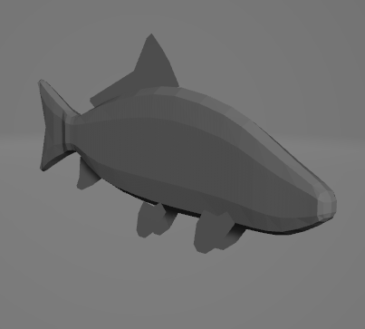
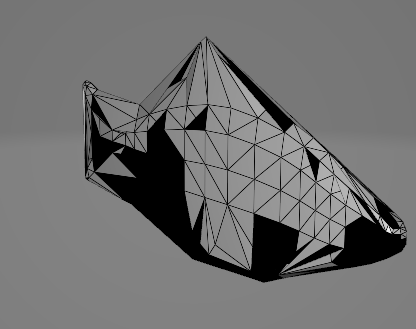

# Лабораторная работа №7

### Тема

Алгоритмы построения триангуляции Делоне

### Задание

Реализовать алгоритм триангуляции Делоне (разделяй и властвуй)

### Результат работы




### Код программы

```python
import stl
import numpy as np
import pyvista as pv

MAX_DEPTH = 3  # Уменьшаем глубину рекурсии


def subdivide_triangle(triangle):
    a, b, c = np.array(triangle[0]), np.array(triangle[1]), np.array(triangle[2])
    ab = (a + b) / 2
    ac = (a + c) / 2
    bc = (b + c) / 2
    return [
        [a.tolist(), ab.tolist(), ac.tolist()],
        [ab.tolist(), b.tolist(), bc.tolist()],
        [ac.tolist(), bc.tolist(), c.tolist()]
    ]


def join(vertices, depth=0):
    if depth >= MAX_DEPTH or len(vertices) <= 3:
        return vertices
    else:
        triangles = [vertices[i:i+3] for i in range(0, len(vertices), 3)]
        middle = len(triangles) // 2
        left_half = join(triangles[:middle], depth + 1)
        right_half = join(triangles[middle:], depth + 1)
        if not left_half or not right_half:
            return []
        return join_2_groups([left_half, right_half])


def join_2_groups(groups):
    result = []
    for group in groups:
        for triangle in group:
            if len(triangle) == 3:
                result.extend(subdivide_triangle(triangle))
    return result


def get_vertices():
    model = stl.Mesh.from_file('fish.stl')
    return np.unique(model.vectors.reshape((-1, 3, 3)), axis=0)


def save(model, path: str):
    _ = model
    surface = pv.read('fish.stl')
    volume = surface.delaunay_3d(alpha=1)
    surface = volume.extract_surface()
    surface.save(path)


def main():
    vertices = get_vertices()
    res = join(vertices)
    if res:
        save(res, 'result.stl')
    else:
        print("Ошибка: не удалось разделить треугольники.")


if __name__ == "__main__":
    main()

```
