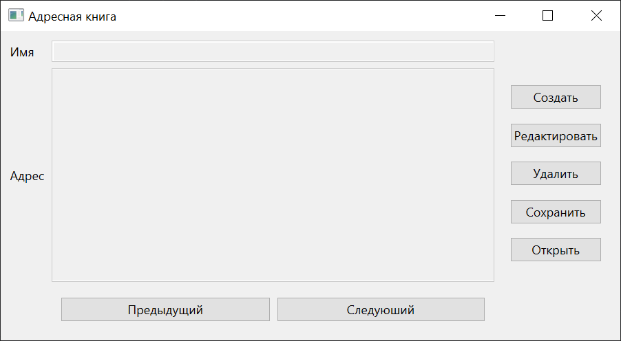
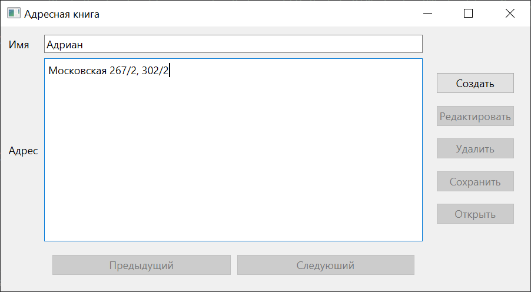
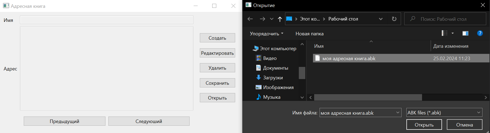

# Лабораторная работа № 2

## Разработка приложения "Адресная книга" средствами Qt

## Цель работы 
Изучить базовые компоненты средства разработки графического интерфейса среды Qt

## Ход работы
В ходе работы над лабораторной работой была реализована программа "Адресная Книга", которая позволяла при помощи ГИП добавлять записи, просматривать их, редактировать, сохранять/открывать файлы с записями.

## Код программы
main.py (отвечает за запуск оконного приложения)
```python
import sys
from window import *

if __name__ == "__main__":
    app = QtWidgets.QApplication([])
    widget = MainWindow()
    widget.show()
    sys.exit(app.exec())
```

adress_book.py (функции для работы с адресной книгой)
```python
class AdressBook:

    book: dict
    current_adress: str = ""

    def __init__(self):
        pass

    def add(self, name: str, adress: str) -> None:
        pass

    def delete(self) -> None:
        pass

    def get_current(self) -> tuple | None:
        pass

    def prev(self) -> None:
        pass

    def next(self) -> None:
        pass

    def save(self, path: str) -> None:
        pass

    def read(self, path: str) -> None:
        pass

    def edit(self, old_record: tuple, new_record: tuple) -> None:
        pass

```

## Результаты работы




