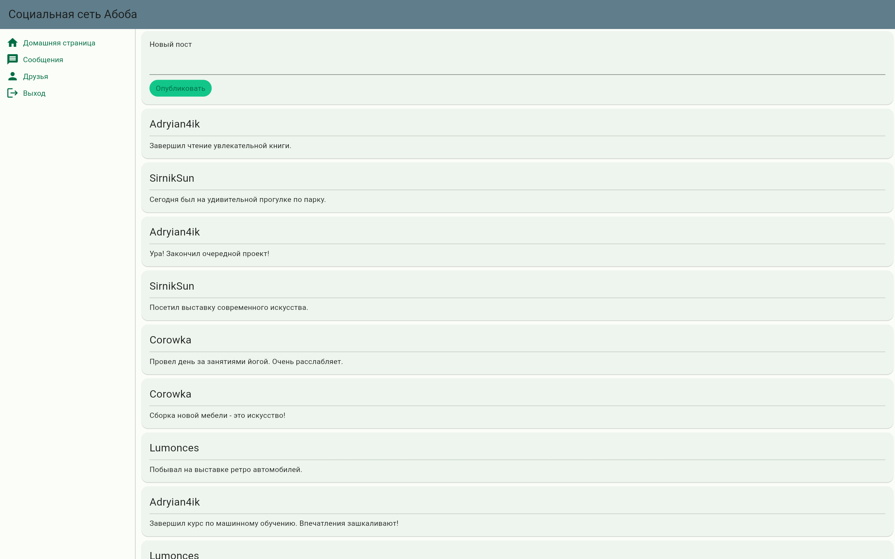
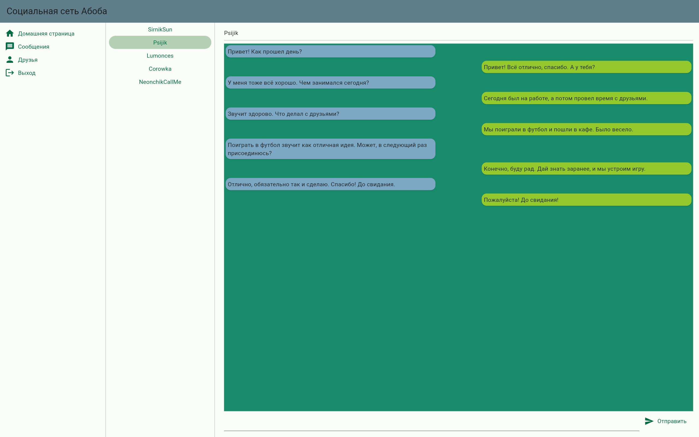
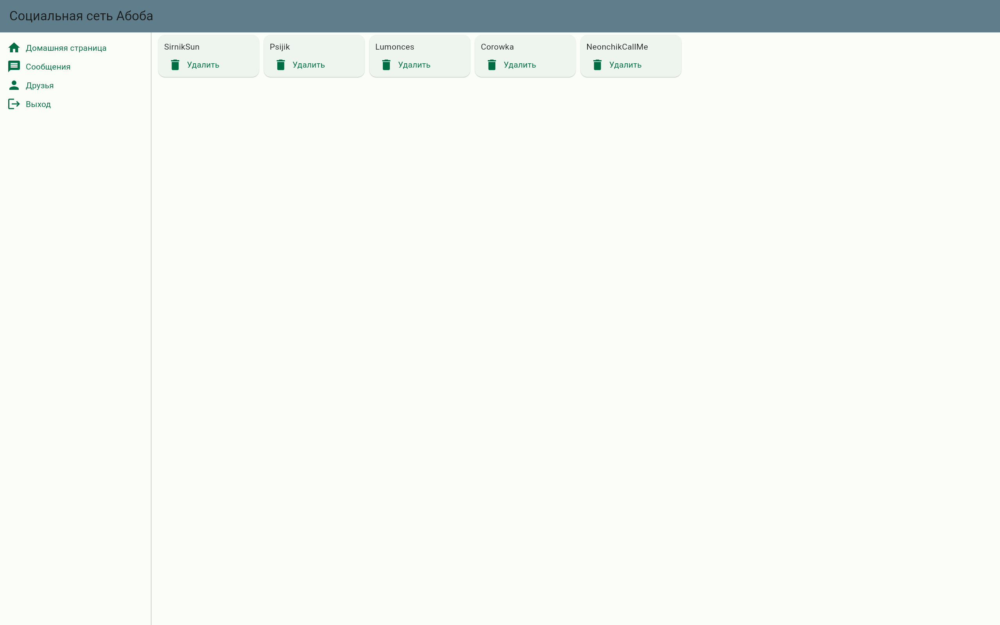

# Лабораторная работа № 3

## Разработка макета сайта без функциональной части

## Цель работы 
Разработать макет высокого уровня сайта

## Ход работы
В ходе работы был разработан макет сайта социальной сети без функциональной части на фреймфворке Flutter.
## Код программы
main.dart основной файл, в котором настраиваетс роутинг.
```dart
import 'package:flutter/material.dart';
import './exit_page.dart';
import './friends_page.dart';
import './home_page.dart';
import './messages_page.dart';

void main() {
  runApp(const MyApp());
}

class MyApp extends StatelessWidget {
  const MyApp({super.key});

  @override
  Widget build(BuildContext context) {
    return MaterialApp(
      title: 'Flutter Demo',
      theme: ThemeData(
        colorScheme: ColorScheme.fromSeed(
            seedColor: const Color.fromARGB(255, 33, 183, 120)),
        useMaterial3: true,
      ),
      initialRoute: '/',
      routes: {
        '/': (context) => const HomePage(),
        '/messages': (context) => const MessagePage(),
        '/friends': (context) => const FriendsPage(),
        '/logout': (context) => const ExitPage(),
      },
    );
  }
}


```

## Результаты работы




