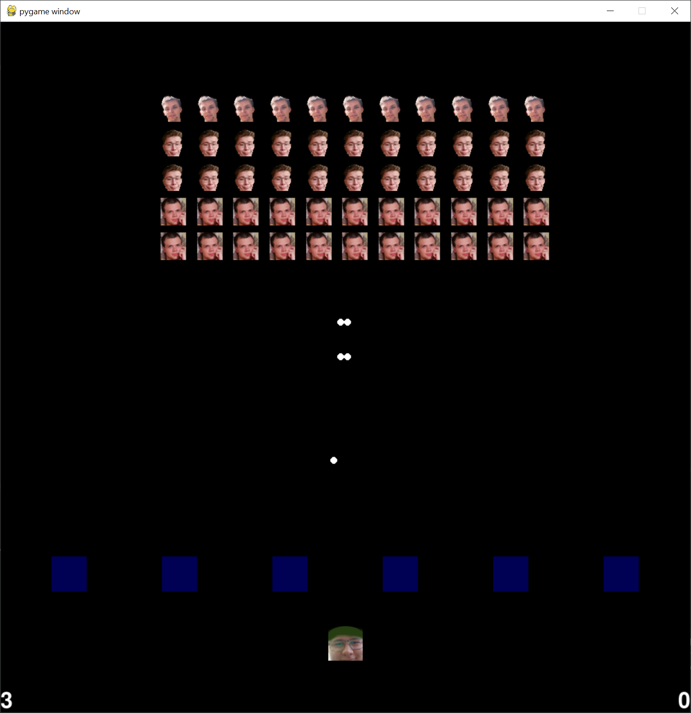
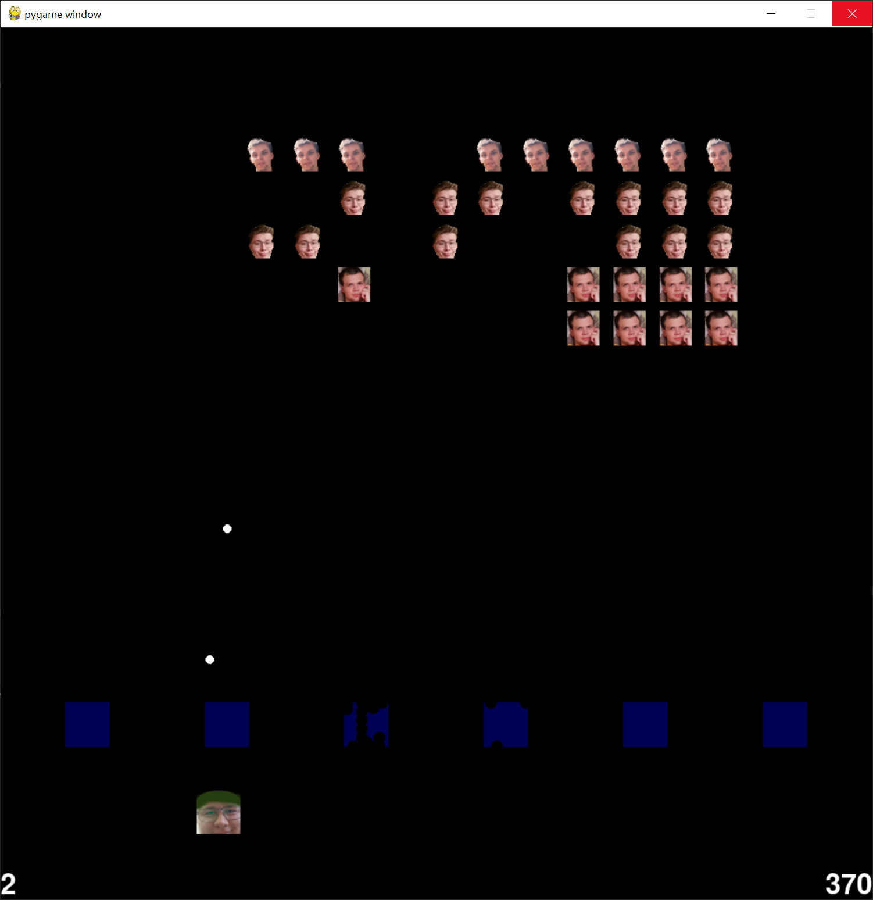
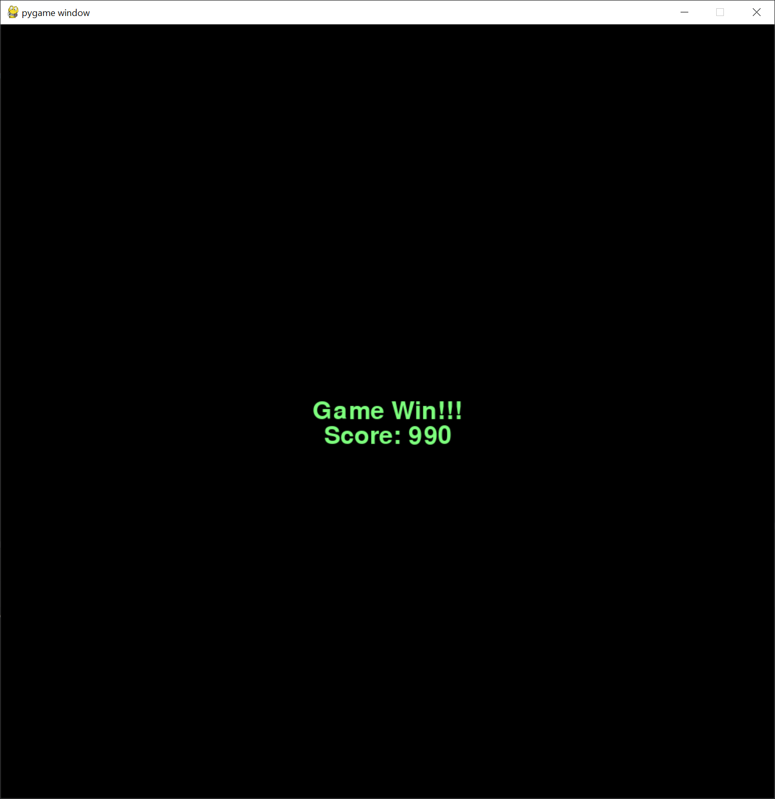

# Лабораторная работа № 4-5

## Разработка игры

## Цель работы 
Изучить разработку игры.

## Ход работы
В ходе работы над лабораторной работой была реализована игра "Space Invaders" на языке Python при помощи библиотеки pygame.

## Код программы
main.py (отвечает за запуск приложения приложения)
```python
from application import App


def main():
    app: App = App()
    app.work()


if __name__ == "__main__":
    main()
```
Структура классов и их иерархии
```python
class Shoot:
    is_correct: bool = True
    is_player_shoot: bool
    direction: np.array
    position: np.array

    def __init__(self, position: np.array, is_players_shoot: bool):
        pass

    def move(self) -> None:
        pass


class Player:
    size: np.array = np.array([25, 25])
    lives: int = 3
    position: np.array = np.array([window_size[0] / 2, window_size[1] - 100])
    score: int = 0
    speed: int = 5
    cooldown_tick: int = 0

    def __init__(self):
        pass

    def update_position(self, direction: bool)-> None:
        pass

    def decrement_cooldown(self) -> None:
        pass


class Invador:
    position: np.array
    type_of_person: int
    size: int = 20
    is_destroyed: bool = False

    def __init__(self, row_index: int, column_index: int):
        pass


class Block:
    size: tuple = (51, 51)

    block: np.array
    center: np.array

    def __init__(self, column_index: int):
        pass

    def collision_detection(self, shoot: Shoot) -> bool:
        pass


class Game:
    is_begining: bool = False
    is_running: bool = False
    is_gameover: bool = False
    is_gamewin: bool = False
    is_paused: bool = False

    player: Player = Player()
    blocks: list[Block]
    invadors: list[Invador]
    shoots: list[Shoot]
    ticks_for_move: list

    def __init__(self):
        pass

    def start_game(self) -> None:
        pass

    def game_tick(self) -> None:
        pass

    def add_player_shot(self) -> None:
        pass

    def add_invadors_shoots(self) -> None:
        pass

    def player_minus_live(self) -> None:
        pass

    def shoot_colision(self) -> None:
        pass

    def game_win(self) -> None:
        pass

    def game_over(self) -> None:
        pass

    def invadors_move(self, direction: np.array) -> None:
        pass


class App:
    is_running: bool = True
    clock: pygame.time.Clock = pygame.time.Clock()
    game: Game = Game()
    ticks: int = 0
    font: pygame.font.Font

    def __init__(self):
        pass

    def quit(self) -> None:
        pass

    def work(self) -> None:
        pass

```

## Результаты работы




