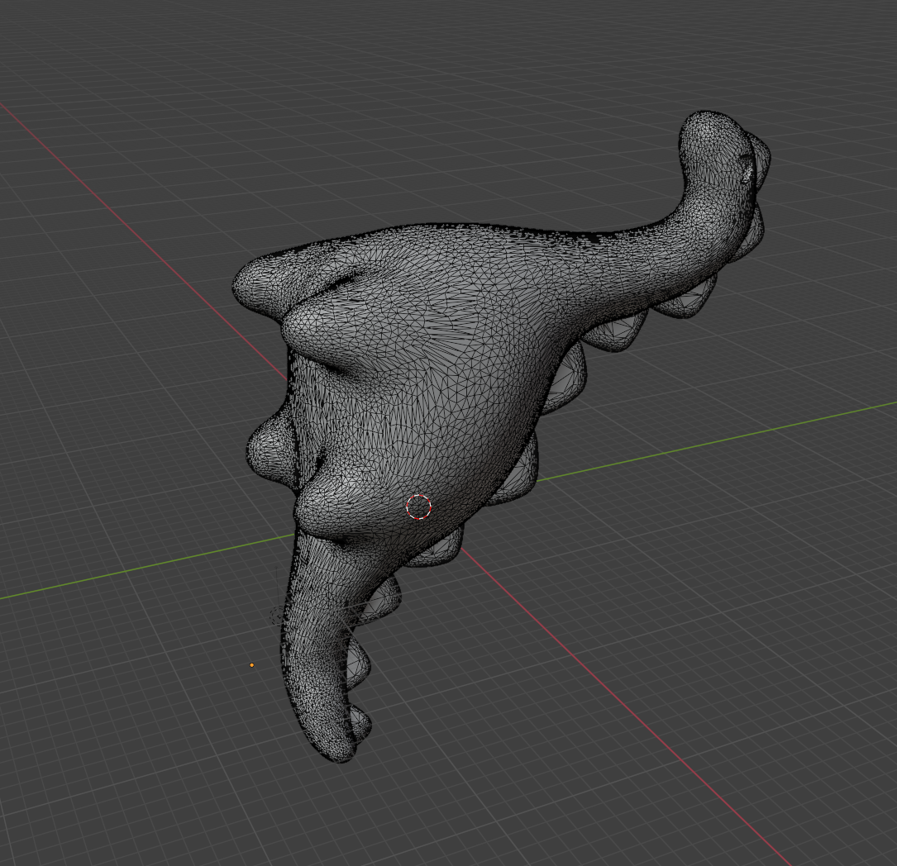
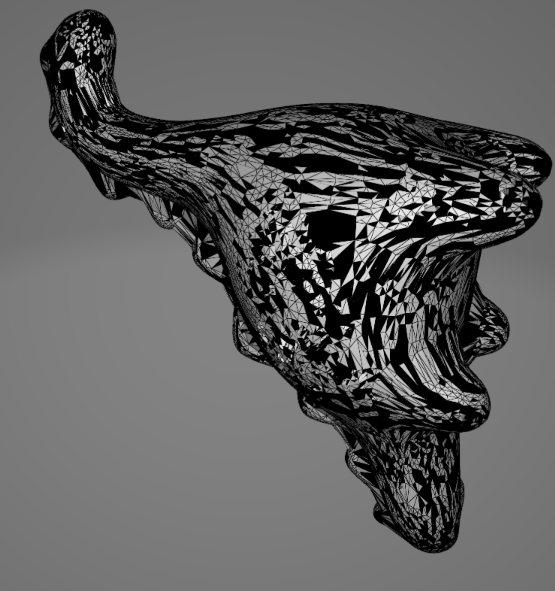

# Лабораторная работа № 7

## Алгоритмы построения триангуляции Делоне

## Цель работы 
Изучить алгоритмы построения триангуляции Делоне.

## Ход работы
В ходе работы был реализован алгоритм для триангуляции "Разделяй и властвуй".

## Код программы
[main.py](./src/main.py) (отвечает за запуск приложения приложения)
```
import stl
import numpy as np
import sys
from math import sqrt, inf
import pyvista as pv

sys.setrecursionlimit(90000)


def get_vertices():
    model = stl.Mesh.from_file('./Diplodocus.stl')
    return model.vectors.reshape((-1, 3))


def vec_len(vector):
    return sqrt(sum([(coord ** 2) for coord in vector]))


def get_r(points):
    pass


def get_triangles(list_groups):
    pass


def points_4_to_triangles(points, order):
    pass


def points_5_to_triangles(points, order):
    pass


def join(groups):
    pass


block_list = []


def join_2_groups(groups):
    pass


def save(model, path: str):
    pass


def main():
    vertices = get_vertices()
    vertices = np.unique(vertices, axis=0)
    res = join(vertices)
    save(res, 'result.stl')


if __name__ == "__main__":
    main()

```

## Результаты работы
До

После

