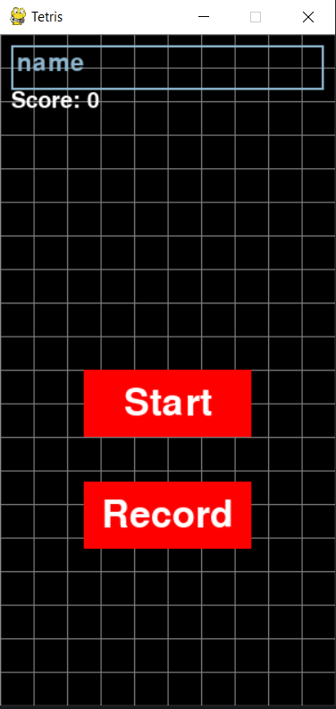
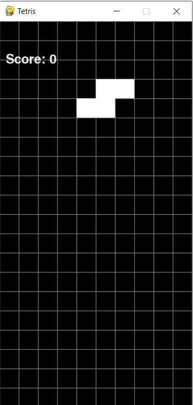

# Лабораторная работа №4-5

## Разработка игры

Создание игры

## Цель работы

Получить знания по разрабокте игры.

## Реализация/ход работы
В ходе работы над лабораторной работой была разработана игра на базе библиотеки pygame.

## Результат работы

Старт приложения:

Игровой процесс:

