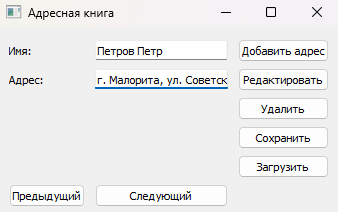
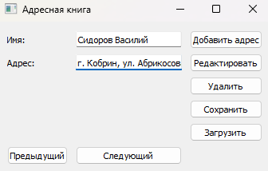
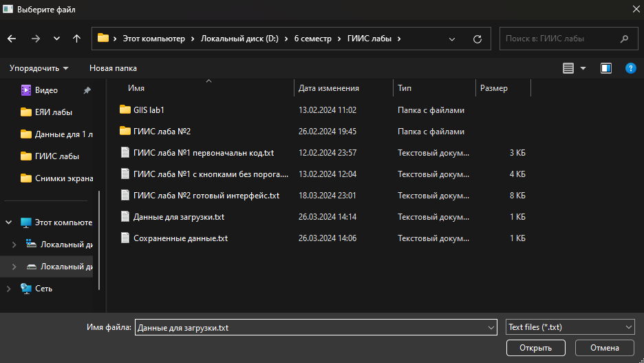
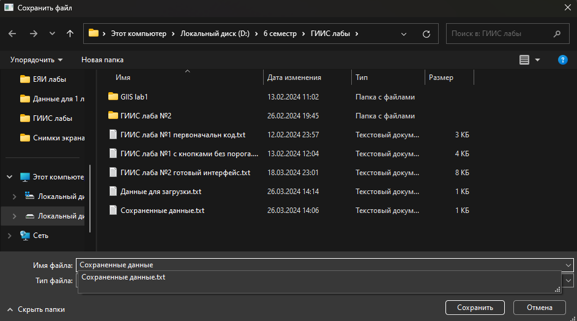
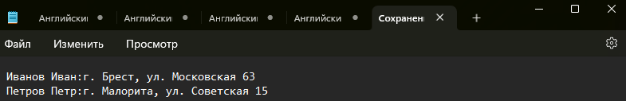

# Лабораторная работа 2

## Разработка приложения "Адресная книга" средствами Qt

## Цель работы
Изучить базовые компоненты средства разработки графического интерфейса среды Qt

## Ход работы
В ходе работы над лабораторной работой была реализована программа "Адресная Книга", которая позволяла при помощи ГИП добавлять записи, просматривать их, редактировать, сохранять/открывать файлы с записями.

## Код программы

import sys
import pickle
from PyQt5.QtWidgets import QApplication, QWidget, QGridLayout, QLabel, QLineEdit, QPushButton, QMessageBox, QFileDialog
from PyQt5.QtWidgets import QInputDialog

class AddressBook(QWidget):
    def __init__(self):
        super().__init__()
        self.addresses = []  # Список для хранения адресов
        self.current_index = -1  # Индекс текущего адреса
        self.initUI()

    def initUI(self):
        self.setWindowTitle('Адресная книга')

        # Создание меток и полей ввода для имени и адреса
        self.name_label = QLabel('Имя:')
        self.name_edit = QLineEdit()
        self.address_label = QLabel('Адрес:')
        self.address_edit = QLineEdit()

        # Создание кнопок для добавления адреса, редактирования, удаления адреса, поиска, предыдущего и следующего адресов
        self.add_button = QPushButton('Добавить адрес')
        self.add_button.clicked.connect(self.addAddress)
        
        self.edit_button = QPushButton('Редактировать')
        self.edit_button.clicked.connect(self.editAddress)
        
        self.delete_button = QPushButton('Удалить')
        self.delete_button.clicked.connect(self.deleteAddress)
        
        self.save_button = QPushButton('Сохранить')
        self.save_button.clicked.connect(self.saveData)
        
        self.load_button = QPushButton('Загрузить')
        self.load_button.clicked.connect(self.loadData)

        self.prev_button = QPushButton('Предыдущий')
        self.prev_button.clicked.connect(self.showPreviousAddress)
        
        self.next_button = QPushButton('Следующий')
        self.next_button.clicked.connect(self.showNextAddress)

## Результаты работы

