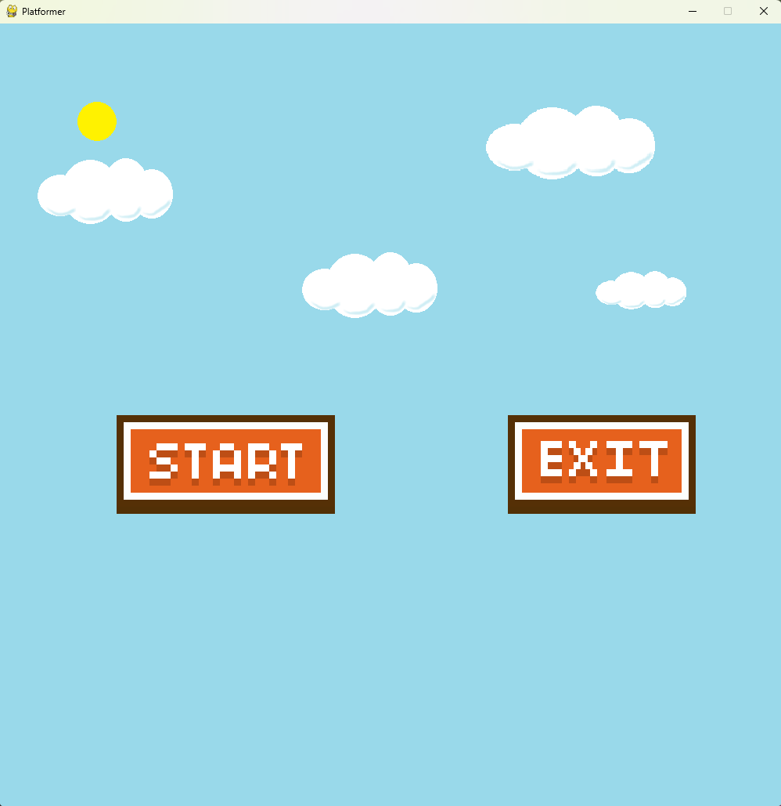
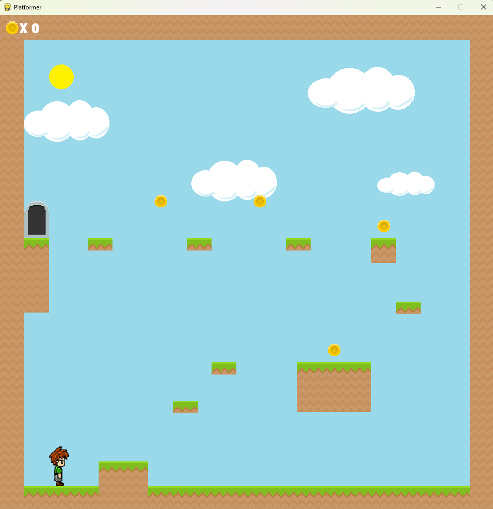

# Лабораторная работа №4-5

## Разработка игры

## Цель работы
Изучить разработку игры.

## Ход работы
В ходе работы над лабораторной работой была реализована игра "Платформер" на языке программирования Python с использованием библиотеки pygame.

## Код программы

class Button():
    def __init__(self, x, y, image):
        self.image = image
        self.rect = self.image.get_rect()
        self.rect.x = x
        self.rect.y = y
        self.clicked = False

    def draw(self):
        action = False

        # Получение позиции мыши
        pos = pygame.mouse.get_pos()

        # Проверка наведения мыши и нажатия
        if self.rect.collidepoint(pos):
            if pygame.mouse.get_pressed()[0] == 1 and self.clicked == False:
                action = True
                self.clicked = True

        if pygame.mouse.get_pressed()[0] == 0:
            self.clicked = False

        # Отрисовка кнопки
        screen.blit(self.image, self.rect)

        return action

## Результаты работы

