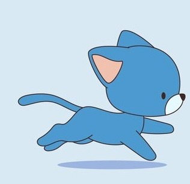
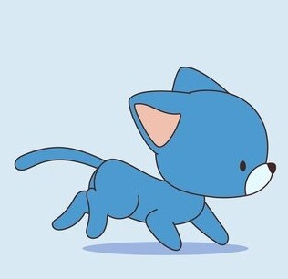
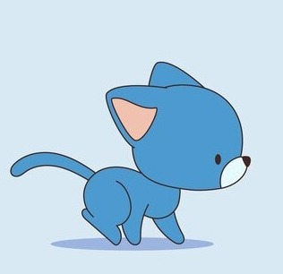
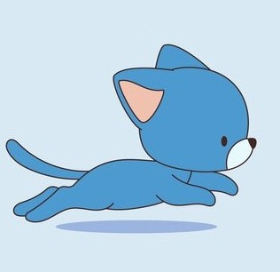

# Лабораторная работа №6

## Создание анимации

## Цель работы
Создать анимацию. Минимальная продолжительность не менее 5 секунд

## Ход работы
В ходе работы над лабораторной работой была реализована анимация котенка, который бегает, на языке программирования Python с использованием библиотеки pygame.

## Код программы

import pygame
import sys

# Инициализация pygame
pygame.init()

# Установка размеров экрана
WIDTH, HEIGHT = 317, 307
screen = pygame.display.set_mode((WIDTH, HEIGHT))
pygame.display.set_caption("Анимация бегущего котенка")

# Загрузка изображений для анимации котенка
cat_frames = [pygame.image.load(f"D:/6 семестр/ГИИС лабы/ГИИС лаба №6/images/cat{i}.png") for i in range(1, 6)]

# Создание класса для котенка
class Cat:
    def __init__(self, x, y):
        self.x = x
        self.y = y
        self.current_frame = 0
        self.frame_counter = 0

    def draw(self):
        screen.blit(cat_frames[self.current_frame], (self.x, self.y))

    def update_animation(self):
        self.frame_counter += 1
        if self.frame_counter >= 2.3:  # Порог смены кадра
            self.current_frame = (self.current_frame + 1) % len(cat_frames)
            self.frame_counter = 0

# Создание объекта котенка
cat = Cat(0, 0)

clock = pygame.time.Clock()

running = True
while running:
    for event in pygame.event.get():
        if event.type == pygame.QUIT:
            running = False

    # Очищаем экран
    screen.fill((255, 255, 255))  # Белый фон

    # Отрисовываем котенка и обновляем его анимацию
    cat.draw()
    cat.update_animation()

    # Обновляем экран
    pygame.display.flip()

    # Ограничиваем частоту обновления экрана
    clock.tick(30)

pygame.quit()
sys.exit()

## Результаты работы

