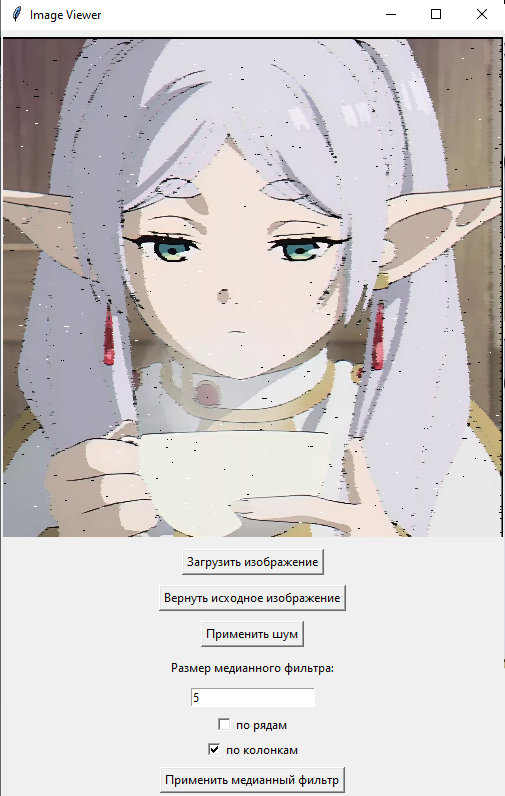

## Лабораторная работа №1

### Задание

Составить программу, выполняющую фильтрацию изображения от импульсных помех.

#### Необходимые характеристики

Изображение хранится во внешнем файле;
программно в изображение вносятся помехи;
программа должна выводить исходное и отфильтрованное изображения;
Должна присутствовать возможность выбора уровня зашумления.
Использовать медианный фильтр. Окно должно осуществлять проход изображения по строкам и столбцам.

### Результат работы



##### ГУИ программы


1. Исходные изображение; 2. Зашумленные изображения; 3. Востановленные по рядам; 4. Востановленные по столбцам; 5. Востановленные изображения по рядам и столбцам

### Код программы

```
  def __init__(self, root):
    self.root = root
    self.root.title("Image Viewer")

    self.image_label = tk.Label(root)
    self.image_label.pack(pady=5)

    self.load_button = tk.Button(root, text="Загрузить изображение", command=self.load_image)
    self.load_button.pack(pady=5)

    self.reset_button = tk.Button(root, text="Вернуть исходное изображение", command=self.apply_reset)
    self.reset_button.pack(pady=5)

    self.noise_button = tk.Button(root, text="Применить шум", command=self.apply_noise)
    self.noise_button.pack(pady=5)

    self.filter_size_label = tk.Label(root, text="Размер медианного фильтра:")
    self.filter_size_label.pack(pady=5)

    self.filter_size_entry = tk.Entry(root)
    self.filter_size_entry.pack(pady=5)

    checkbox_var1 = tk.IntVar()
    checkbox_var2 = tk.IntVar()

    checkbox1 = tk.Checkbutton(root, text="по рядам", variable=checkbox_var1, onvalue=1, offvalue=0,
                                command=self.on_checkbox_clicked1)
    checkbox2 = tk.Checkbutton(root, text="по колонкам", variable=checkbox_var2, onvalue=1, offvalue=0,
                                command=self.on_checkbox_clicked2)
    checkbox1.pack()
    checkbox2.pack()

    self.median_filter_button = tk.Button(root, text="Применить медианный фильтр", command=self.apply_median_filter)
    self.median_filter_button.pack(pady=5)

    self.original_image = None
    self.noise_image = None
    self.row = False
    self.column = False
```
