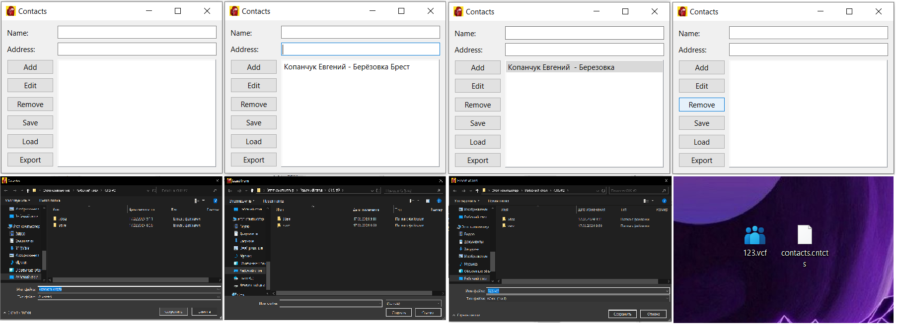

## Лабораторная работа №2

### Тема

Разработка приложения «Адресная книга» средствами Qt

### Задание

Выполнить последовательно разработку приложения «Адресная книга», согласно учебному пособию расположенному по адресу (K:\LOOK\4-kurs\ГИИС\Lab3\crossplatform\tutorials-addressbook.html)

1. Добавление адресов
2. Навигация по записям
3. Редактирование и удаление адресов
4. Добавляем функцию поиска
5. Загрузка и сохранение
6. Дополнительные функции

### Результат работы



### Код программы

```
class MainWindow(QMainWindow):

  def __init__(self):
    super().__init__()
    self.contacts = []
    self.setWindowTitle("Contacts")
    self.setWindowIcon(QIcon("icon.ico"))
    self.layout = QGridLayout()
    self.label_name = QLabel("Name:")
    self.label_name.setFixedWidth(60)
    self.label_address = QLabel("Address:")
    self.label_address.setFixedWidth(60)
    self.input_name = QLineEdit()
    self.input_name.textChanged.connect(self.on_text_changed)
    self.input_address = QLineEdit()
    self.input_address.textChanged.connect(self.on_text_changed)
    self.button_add = QPushButton("Add")
    self.button_add.clicked.connect(self.add_contact)
    self.button_edit = QPushButton("Edit")
    self.button_edit.clicked.connect(self.edit_contact)
    self.button_remove = QPushButton("Remove")
    self.button_remove.clicked.connect(self.remove_contact)
    self.button_save = QPushButton("Save")
    self.button_save.clicked.connect(self.save_contacts)
    self.button_load = QPushButton("Load")
    self.button_load.clicked.connect(self.load_contacts)
    self.button_export = QPushButton("Export")
    self.button_export.clicked.connect(self.export_contacts)
    self.list = QListWidget()
    self.list.itemClicked.connect(self.select_contact)
    self.layout.addWidget(self.label_name, 0, 0)
    self.layout.addWidget(self.input_name, 0, 1)
    self.layout.addWidget(self.label_address, 1, 0)
    self.layout.addWidget(self.input_address, 1, 1)
    self.layout.addWidget(self.button_add, 2, 0)
    self.layout.addWidget(self.button_edit, 3, 0)
    self.layout.addWidget(self.button_remove, 4, 0)
    self.layout.addWidget(self.button_save, 5, 0)
    self.layout.addWidget(self.button_load, 6, 0)
    self.layout.addWidget(self.button_export, 7, 0)
    self.layout.addWidget(self.list, 2, 1, 6, 1)
    self.setLayout(self.layout)
    self.container = QWidget()
    self.container.setLayout(self.layout)
    self.setCentralWidget(self.container)
```
