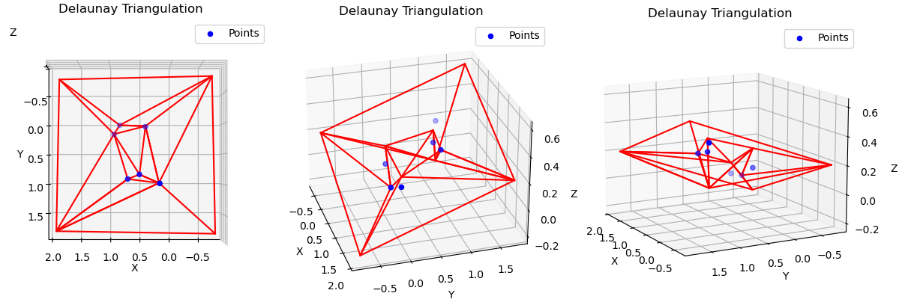

# Лабораторная работа №7

### Тема

Алгоритмы построения триангуляции Делоне

### Задание

Реализовать алгоритм триангуляции Делоне (разделяй и властвуй)

### Результат работы



### Код программы

```python
seeds = np.random.random((seed_count, 2))
start_cords = [(-1, -1), (+1, -1), (+1, +1), (-1, +1)]
Z =  [(_[1] - _[0] + 1) / 5 for _ in start_cords + list(seeds)]

dt = Delaunay2D()
for s in seeds:
    dt.addPoint(s)

center = np.mean(seeds, axis=0)
radius = np.max(np.linalg.norm((seeds - center), axis=1))
dt = Delaunay2D(center, 2 * radius)
perm = sorted(range(len(seeds)), key=lambda i: seeds[i][0])
for i in perm:
    dt.addPoint(seeds[i])

coords, triangles = dt.exportExtendedDT()
```
