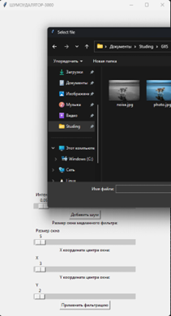
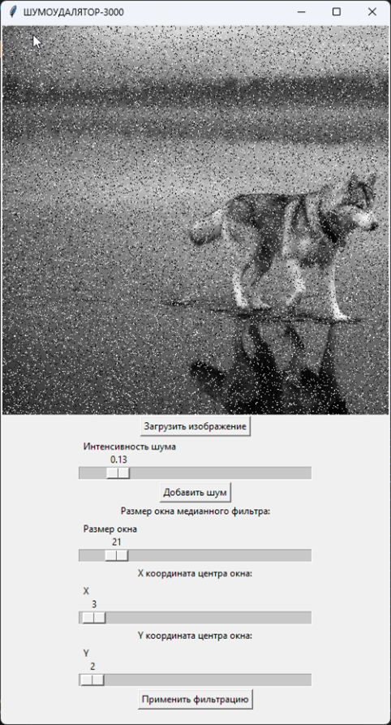
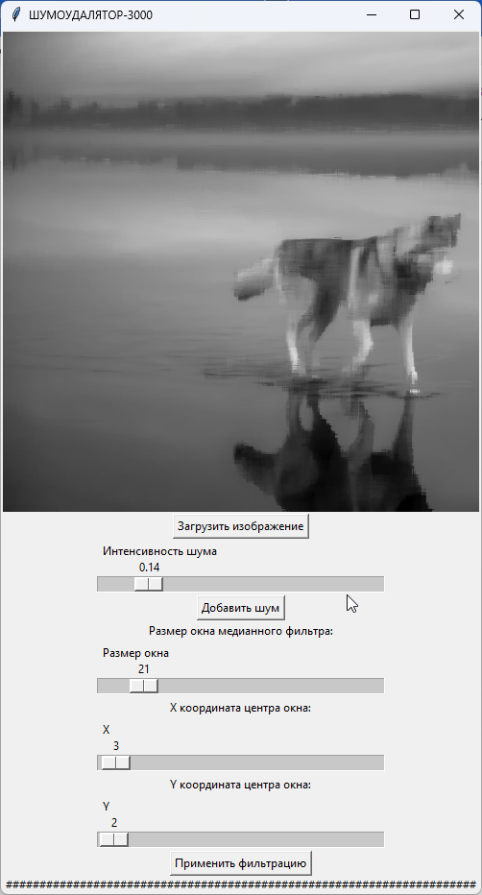

# Лабораторная работа №1 #
## Тема ##

Фильтрация изображения от импульсных помех

## Цель работы ##

Фильтрация изображения от импульсных помех.

## Вариант 1 ##

## Задание ##

Составить программу, выполняющую фильтрацию изображения от импульсных помех.

Необходимые характеристики:
+ изображение хранится во внешнем файле;
+ программно в изображение вносятся помехи (точки, линии, ...);
+ программа должна выводить исходное и отфильтрованное изображения, должна присутствовать возможность выбора уровня зашумления, порога фильтра, размера окна.
+ Варианты (тип фильтра): медианный фильтр. крестообразное окно различного (!) размера, возможность изменения центра.

## Результат работы ##

