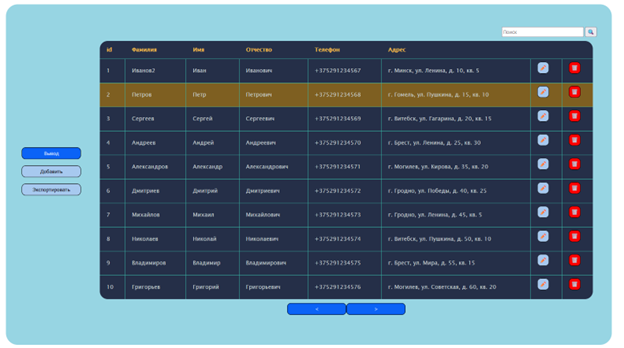
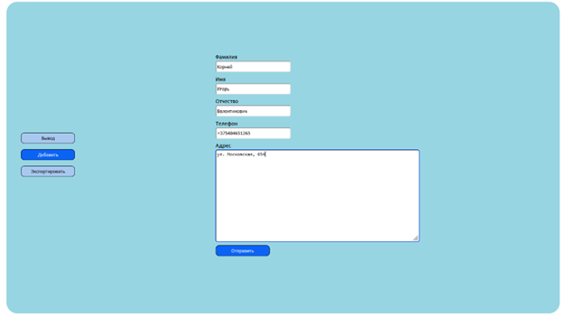

## Лабораторная работа №2   ##

## Тема ##

Разработка приложения «Адресная книга» средствами Qt

## Цель работы ##

Изучить базовые компоненты средства разработки графического интерфейса среды Qt.

## Задание ##

Выполнить последовательно разработку приложения «Адресная книга», согласно учебному пособию расположенному по адресу (K:\LOOK\4-kurs\ГИИС\Lab3\crossplatform\tutorials-addressbook.html).

## Результат работы ##

