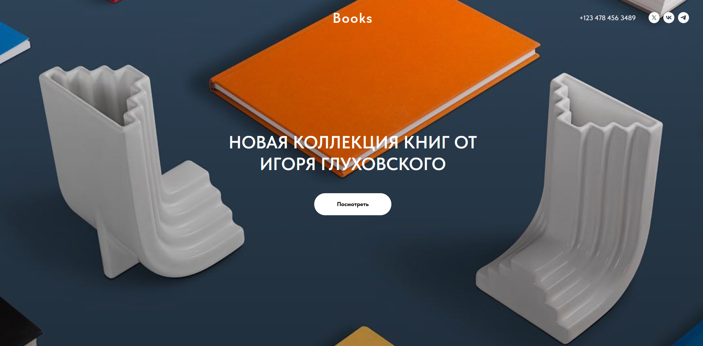
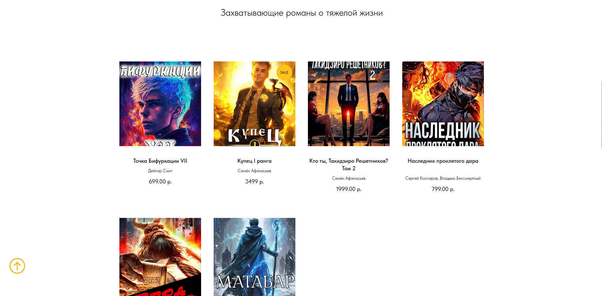
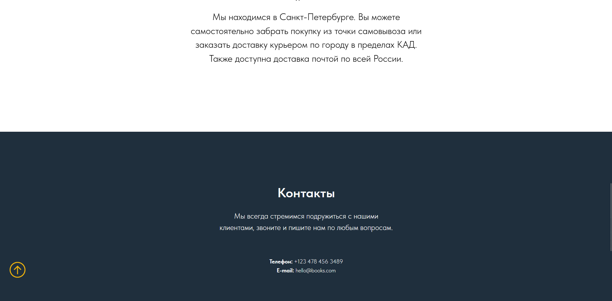
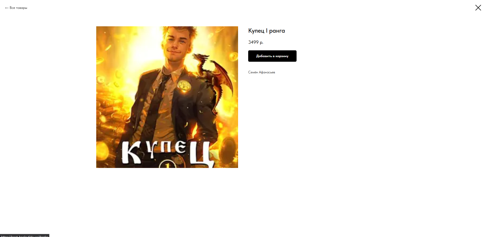
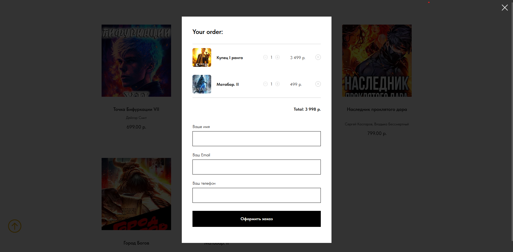

# Лабораторная работа №3 #

## Тема ##

Создание сайта по заданной тематике

## Цель работы ##

Создание сайта по заданной тематике.

## Задание ##

Создание сайта по заданной тематике. Сайт представляет собой макет высокого уровня без функциональной части. Реализовать возможность демонстрации работы сайта, заполняя поля необходимой информацией и демонстрируя переходы между страницами сайта.
Вариант 9. сайт по рекомендации книг

[Ссылка на сайт](https://brest-books.tilda.ws/)

## Результат работы ##

