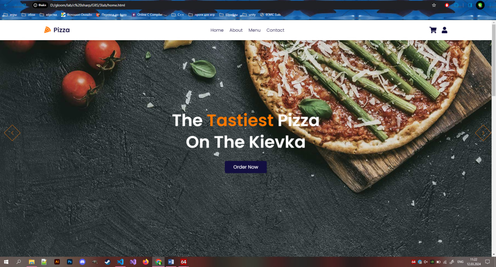
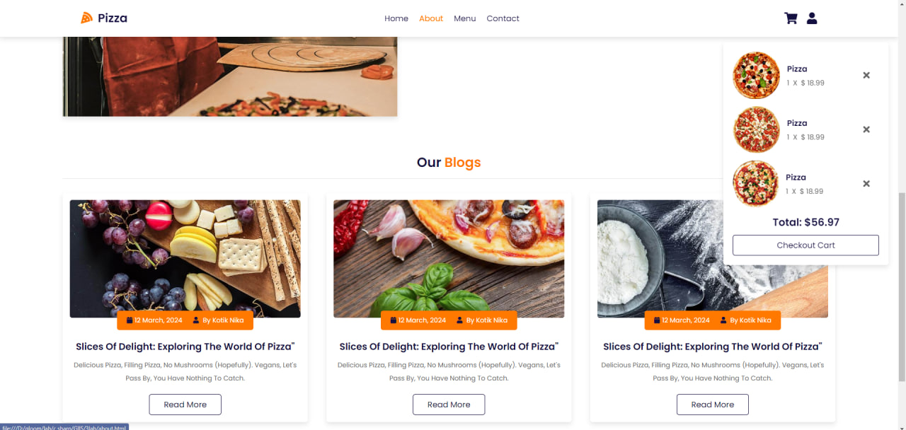
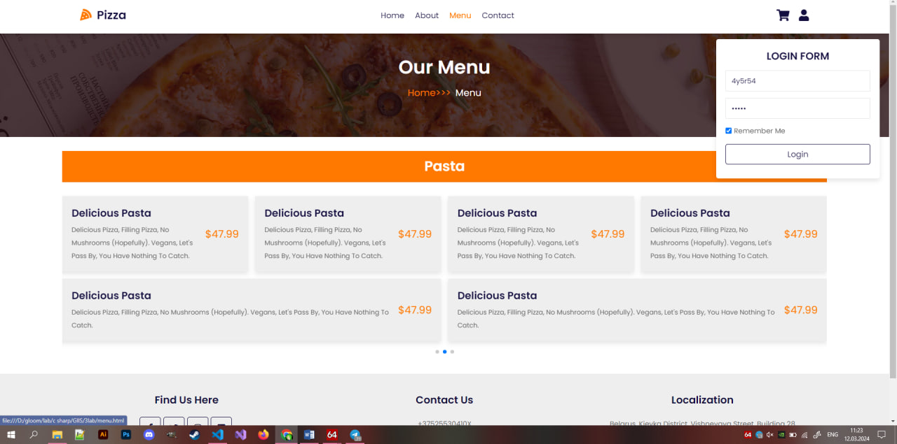
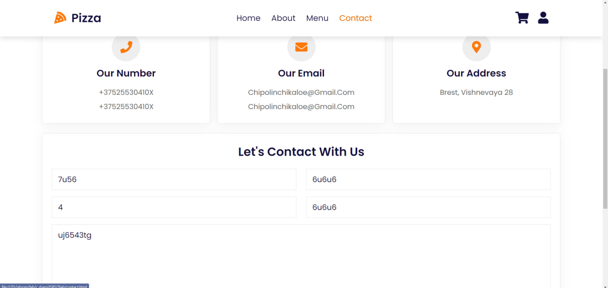

## Лабораторная работа №3 <br/> ##

## Тема ##

Создание сайта по заданной тематике

## Цель работы ##

Создание сайта по заданной тематике.

## Задание ##

Создание сайта по заданной тематике. Сайт представляет собой макет высокого уровня без функциональной части. Реализовать возможность демонстрации работы сайта, заполняя поля необходимой информацией и демонстрируя переходы между страницами сайта.
Вариант 10. сайт общепита

## Результат работы ##







## Код программы ##

### Конструктор и деструктор ###
```js
let cart = document.querySelector('.shopping-cart');

document.querySelector('#cart').onclick = () =>{
  cart.classList.toggle('active');
  login.classList.remove('active');
}

let login = document.querySelector('.login-form');

document.querySelector('#login').onclick = () =>{
  login.classList.toggle('active');
  cart.classList.remove('active');
}

let navbar = document.querySelector('.navbar');

document.querySelector('#menu').onclick = () =>{
  navbar.classList.toggle('active');
  cart.classList.remove('active');
  login.classList.remove('active');
}

window.onscroll = () =>{
  cart.classList.remove('active');
  login.classList.remove('active');
  navbar.classList.remove('active');
}

var swiper = new Swiper(".home-slider", {
  autoplay:{
    delay:7500,
    disableOnInteraction:false,
  },
  grabCursor:true,
  loop: true,
  centeredSlides:true,
  navigation: {
    nextEl: '.swiper-button-next',
    prevEl: '.swiper-button-prev',
  },
});


var swiper = new Swiper(".menu-slider", {
  grabCursor:true,
  loop: true,
  autoHeight:true,
  centeredSlides:true,
  spaceBetwwen:20,
  pagination: {
    el: '.swiper-pagination',
    clickable:true,
  },
});

let previewContainer = document.querySelector('.menu-preview-container');
let previewBox = previewContainer.querySelectorAll('.menu-preview');

document.querySelectorAll('.menu .box').forEach(menu =>{
  menu.onclick = () =>{
    previewContainer.style.display = 'flex';
    let name = menu.getAttribute('data-name');
    previewBox.forEach(preview =>{
      let target = preview.getAttribute('data-target');
      if(name == target){
        preview.classList.add('active');
      }
    });
  };
});

previewContainer.querySelector('#close').onclick = () =>{
  previewContainer.style.display = 'none';
  previewBox.forEach(close =>{
    close.classList.remove('active');
  });
};
```