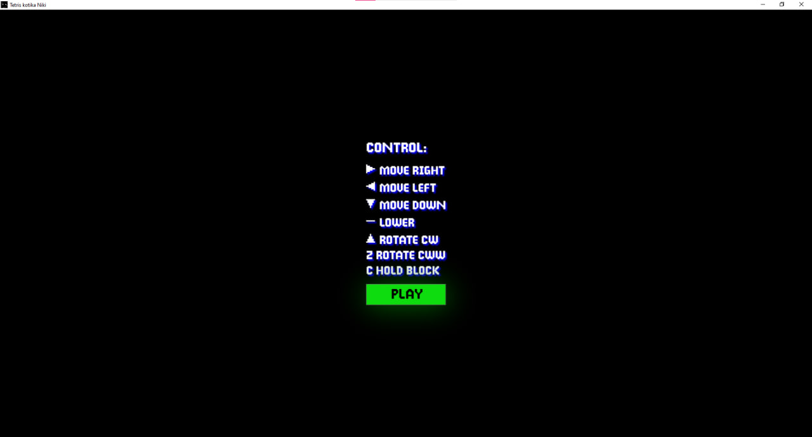
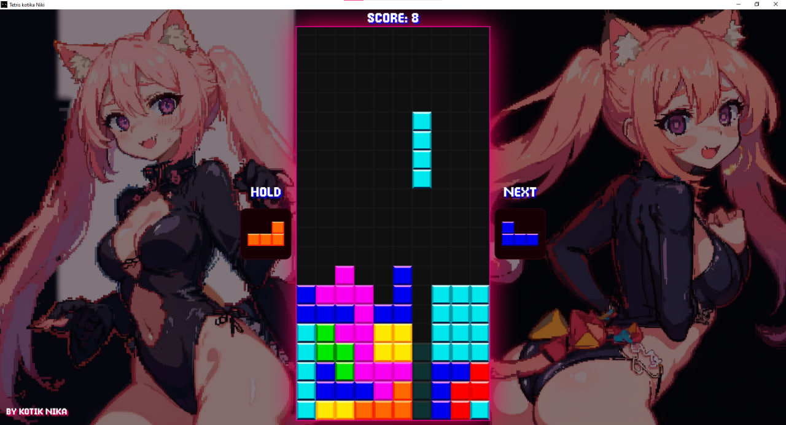
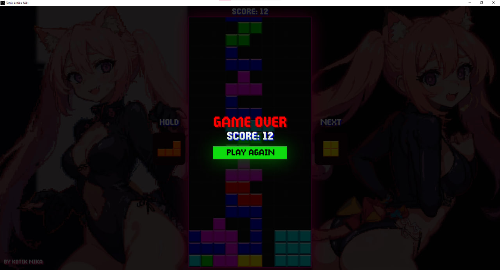

# Лабораторная работа №4 #

## Тема ##

Разработка игры

## Цель работы ##

Создание игры по заданному варианту.

## Задание ##

Создание игры по заданному варианту.
Вариант 2. Тетрис

## Результат работы ##

При запуске нас встретят правила по управлению в игре.

В тетрисе есть подсветка, которая показывает куда упадёт блок, также можно спрятать один блок, если он вам не подходит и вы считаете, что он заруинит катку.

В случае проигрыша нам покажет счет и кнопку, по которой можно начать играть снова.
