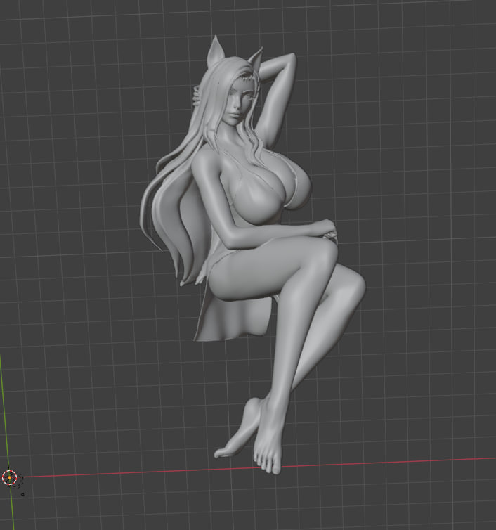
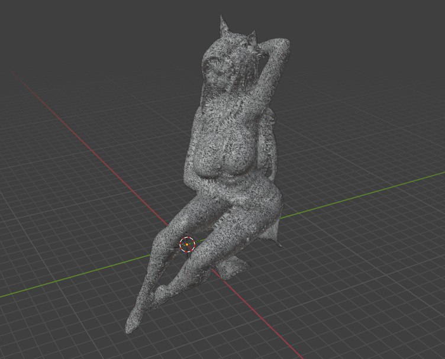

# Лабораторная работа №7 

## Тема 

Алгоритмы построения триангуляции Делоне

## Цель работы 

Реализация выпуклого полосового алгоритма слияния

## Задание 

1. Находим в интернете любой 3d-объект выпуклой формы (можно и рельеф местности взять)
2. Запускаем его в Blender (или любом другом аналоге)
3. Подключаемся к Blender через Python API.

## Результат работы 

Исходня моделька выглядит так

После применения алгоритма

