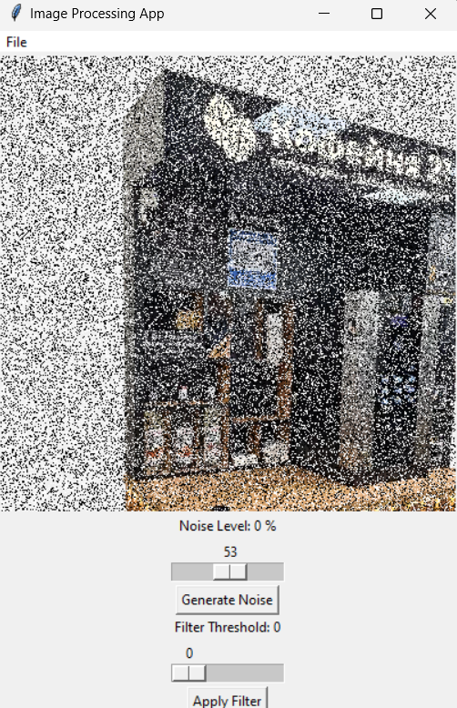
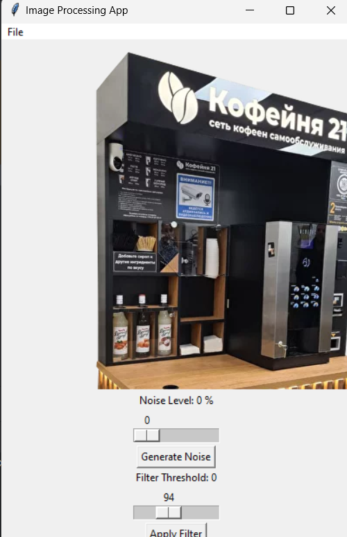

# Лабораторная работа №1 

## Тема

Фильтрация изображения от импульсных помех.

## Цель работы

Фильтрация изображения от импульсных помех.

## Вариант 1

## Реализация/ход работы
Был реализован алгоритм порогового фильтра. Пример работы:

Зашумленное изображение:

Отфильтрованное изображение:

