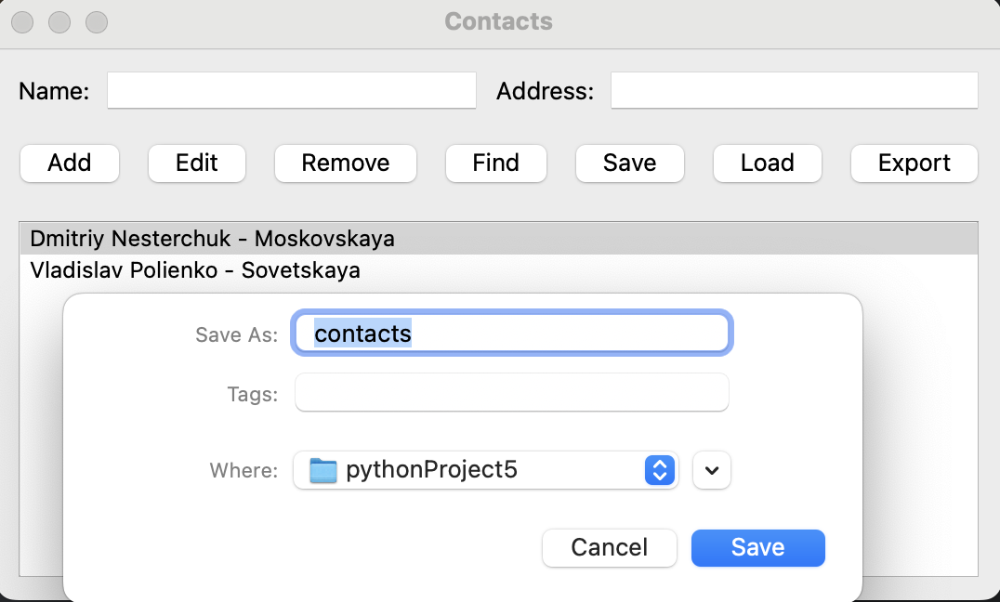

## Лабораторная работа №2

### Тема

Разработка приложения «Адресная книга» средствами Qt

### Задание

Выполнить последовательно разработку приложения «Адресная книга», согласно учебному пособию расположенному по адресу 

1. Добавление адресов
2. Навигация по записям
3. Редактирование и удаление адресов
4. Добавляем функцию поиска
5. Загрузка и сохранение
6. Дополнительные функции

### Результат работы





### Код программы

```
from PyQt6.QtWidgets import QPushButton, QFileDialog, QListWidget, QApplication, QMainWindow, QLabel, QLineEdit, \
    QVBoxLayout, QWidget, QHBoxLayout
from PyQt6.QtGui import QIcon
from PyQt6.QtCore import Qt

import sys


class MainWindow(QMainWindow):

    def __init__(self):
        super().__init__()
        self.contacts = []
        self.setWindowTitle("Contacts")
        self.setWindowIcon(QIcon("icon.ico"))

        main_layout = QVBoxLayout()

        input_layout = QHBoxLayout()
        input_layout.addWidget(QLabel("Name:"))
        self.input_name = QLineEdit()
        input_layout.addWidget(self.input_name)

        input_layout.addWidget(QLabel("Address:"))
        self.input_address = QLineEdit()
        input_layout.addWidget(self.input_address)

        button_layout = QHBoxLayout()
        self.button_add = QPushButton("Add")
        self.button_add.clicked.connect(self.add_contact)
        button_layout.addWidget(self.button_add)

        self.button_edit = QPushButton("Edit")
        self.button_edit.clicked.connect(self.edit_contact)
        button_layout.addWidget(self.button_edit)

        self.button_remove = QPushButton("Remove")
        self.button_remove.clicked.connect(self.remove_contact)
        button_layout.addWidget(self.button_remove)

        self.button_find = QPushButton("Find")
        self.button_find.clicked.connect(self.find_contact)
        button_layout.addWidget(self.button_find)

        self.button_save = QPushButton("Save")
        self.button_save.clicked.connect(self.save_contacts)
        button_layout.addWidget(self.button_save)

        self.button_load = QPushButton("Load")
        self.button_load.clicked.connect(self.load_contacts)
        button_layout.addWidget(self.button_load)

        self.button_export = QPushButton("Export")
        self.button_export.clicked.connect(self.export_contacts)
        button_layout.addWidget(self.button_export)

        main_layout.addLayout(input_layout)
        main_layout.addLayout(button_layout)

        self.list = QListWidget()
        main_layout.addWidget(self.list)

        central_widget = QWidget()
        central_widget.setLayout(main_layout)
        self.setCentralWidget(central_widget)

    def find_contact(self):
        name = self.input_name.text()
        address = self.input_address.text()
        self.list.clear()
        for contact in self.contacts:
            if name.lower() in contact["name"].lower() and address.lower() in contact["address"].lower():
                self.list.addItem(f"{contact['name']} - {contact['address']}")

    def add_contact(self):
        name = self.input_name.text()
        address = self.input_address.text()
        if name and address:
            contact = {"name": name, "address": address}
            self.contacts.append(contact)
            self.list.addItem(f"{name} - {address}")
            self.clear_fields()

    def edit_contact(self):
        selected_row = self.list.currentRow()
        if selected_row != -1:
            name = self.input_name.text()
            address = self.input_address.text()
            if name and address:
                contact = {"name": name, "address": address}
                self.contacts[selected_row] = contact
                self.list.currentItem().setText(f"{name} - {address}")
                self.clear_fields()

    def remove_contact(self):
        selected_row = self.list.currentRow()
        if selected_row != -1:
            del self.contacts[selected_row]
            self.list.takeItem(selected_row)
            self.clear_fields()

    def clear_fields(self):
        self.input_name.clear()
        self.input_address.clear()

    def save_contacts(self):
        filename, _ = QFileDialog.getSaveFileName(
            self, "Save to", "contacts.cntcts", "(*.cntcts)"
        )
        if filename:
            try:
                with open(filename, "w") as file:
                    import json
                    json.dump(self.contacts, file, indent=4)
                print("Contacts are saved perfectly!")
            except Exception as e:
                print(f"Error while saving: {e}")

    def load_contacts(self):
        filename, _ = QFileDialog.getOpenFileName(
            self, "Load from", "", "(*.cntcts)"
        )
        if filename:
            try:
                with open(filename, "r") as file:
                    import json
                    self.contacts = json.load(file)
                    self.list.clear()
                    for contact in self.contacts:
                        self.list.addItem(f"{contact['name']} - {contact['address']}")
                print("Contacts are loaded perfectly!")
            except FileNotFoundError:
                print("Contact's file wasn't found.")
            except Exception as e:
                print(f"Error while loading: {e}")

    def export_contacts(self):
        selected_row = self.list.currentRow()
        if selected_row != -1:
            contact = self.contacts[selected_row]
            name = contact["name"]
            address = contact["address"]
            file_name, _ = QFileDialog.getSaveFileName(
                self, "Export vCard", f"{name}.vcf", "vCard (*.vcf)"
            )
            if file_name:
                with open(file_name, "w") as file:
                    file.write("BEGIN:VCARD\n")
                    file.write("VERSION:3.0\n")
                    file.write("N:;;;;\n")
                    file.write(f"FN:{name}\n")
                    file.write(f"ADR:{address}\n")
                    file.write("END:VCARD\n")
                print("vCard created!")

    def select_contact(self):
        selected_row = self.list.currentRow()
        if selected_row != -1:
            contact = self.contacts[selected_row]
            self.input_name.setText(contact["name"])
            self.input_address.setText(contact["address"])


app = QApplication(sys.argv)

window = MainWindow()
window.show()

sys.exit(app.exec())

```
