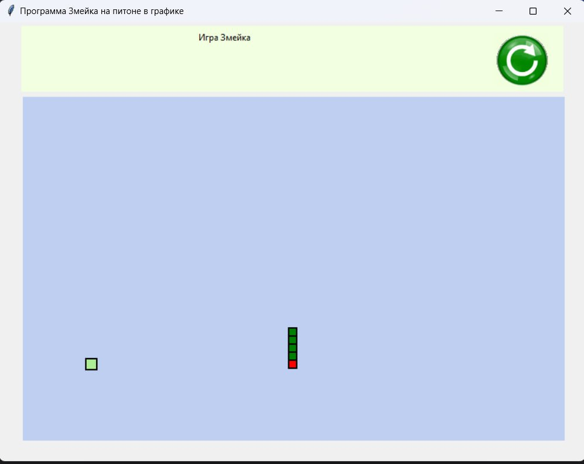

# Лабораторная работа №4 #

## Тема ##

Разработка игры

## Цель работы ##

Создание игры по заданному варианту.

## Задание ##

Создание игры по заданному варианту.
Вариант 5. snake

## Результат работы ##

